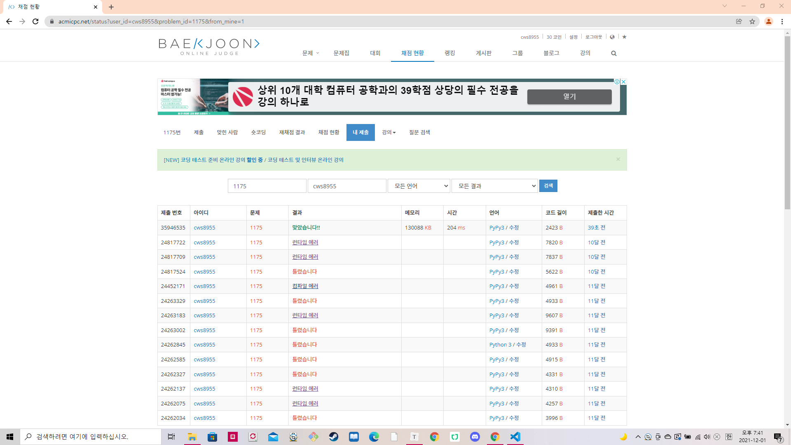

[ 백준 : 배달 ]   (https://www.acmicpc.net/problem/1175)


- 골드1 - Bfs문제인데 너무 쉽게 풀렸다. 
- 예전에는 왜 못풀었지....
- 로직은 단순하다. 일반 bfs랑 똑같다. 다만 visit을 4차원 배열로 만들어준다.
- y좌표, x좌표, 전에 이동한 방향, 배달을 어디에 했는지 여부


- 여기서 배달을 어디에 했는지 여부가 헷갈릴 수 있어서 C를 하나는 A로 하나는 B로 바꾸었으며 한군데 도 방문하지 않았을 경우 방문배열의 0, A를 방문 했을 경우 1, B를 방문 했을 경우 2, 둘 다 방문했을 경우 3을 넣어준다.


```python
import sys
sys.stdin = open('1175.txt','r')
from collections import deque

n,m = map(int,input().split())
arr = []
for _ in range(n):
    ar = list(input())
    arr.append(ar)

visit = [[[[0]*4 for _ in range(4)] for _ in range(m)] for _ in range(n)]
c1_y, c1_x, c2_y, c2_x = None , None, None, None
sy,sx = None, None
dy = [0,0,-1,1]
dx = [-1,1,0,0]

for y in range(n):
    for x in range(m):
        if arr[y][x] == 'C' and c1_x == None:
            c1_y = y
            c1_x = x
            arr[y][x] = 'A'
        elif arr[y][x] == 'C' and c1_x != None:
            c2_y = y
            c2_x = x
            arr[y][x] = 'B'
        elif arr[y][x] == 'S':
            sy = y
            sx = x

answer = -1
q = deque()
q.append([sy,sx,0,-1,0])

while q:
    y,x,cnt,d,move = q.popleft()

    if cnt == 3:
        answer = move
        break

    for k in range(4):
        ny = y+dy[k]
        nx = x+dx[k]
        if 0<=ny<n and 0<=nx<m:
            if k != d:
                if arr[ny][nx] == '.' or arr[ny][nx] == 'S':
                    if visit[ny][nx][cnt][k] == 0:
                        visit[ny][nx][cnt][k] = 1
                        q.append([ny,nx,cnt,k,move+1])
                elif arr[ny][nx] == 'A':
                    if cnt == 0:
                        if visit[ny][nx][1][k] == 0:
                            visit[ny][nx][1][k] = 1
                            q.append([ny,nx,1,k,move+1])
                    elif cnt == 1:
                        if visit[ny][nx][1][k] == 0:
                            visit[ny][nx][1][k] = 1
                            q.append([ny,nx,1,k,move+1])
                    elif cnt == 2:
                        if visit[ny][nx][3][k] == 0:
                            visit[ny][nx][3][k] = 1
                            q.append([ny,nx,3,k,move+1])
                elif arr[ny][nx] == 'B':
                    if cnt == 0:
                        if visit[ny][nx][2][k] == 0:
                            visit[ny][nx][2][k] = 1
                            q.append([ny,nx,2,k,move+1])
                    elif cnt == 1:
                        if visit[ny][nx][3][k] == 0:
                            visit[ny][nx][3][k] = 1
                            q.append([ny,nx,3,k,move+1])
                    elif cnt == 2:
                        if visit[ny][nx][2][k] == 0:
                            visit[ny][nx][2][k] = 1
                            q.append([ny,nx,2,k,move+1])

print(answer)
```

