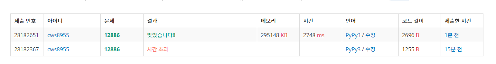

[백준 : 돌 그룹] (https://www.acmicpc.net/problem/12886)


##### 2021.04.09


- 단순 bfs문제
- 다만 방문을 체크해주는 경우를 어떻게 해야할지 헷갈렸었다.
- 3차원 방문 판을 만들기에는 너무 메모리가 커졌다.
- lst에 하나씩 방문한 애들을 넣고 not in lst로 하면 시간초과가 났다
- 그래서 set을 이용해서 풀었다.
- l1과 l2가 다르다는 얘기는 지금 넣는 애가 set에 없다는 이야기 이므로 q에 추가해준다


```python
import sys
sys.stdin = open('12886.txt','r')
from collections import deque
# from copy import deepcopy

a,b,c = map(int, input().split())
lst = set()

q = deque()
q.append([a,b,c])
lst.add((a,b,c))
answer = 0
# print(answer)
# visit = [[[0]*1001 for _ in range(1001)] for _ in range(1001)]
# visit[a][b][c] = 1
# print(visit)
while q:
    x,y,z = q.popleft()
    # print(x,y,z)

    # xx = deepcopy(x)
    # yy = deepcopy(y)
    # zz = deepcopy(z)

    if x == y and y == z:
        answer = 1
        break


    if x != y:
        if x > y:
            temp = (x-y,y+y,z)
            l1 = len(lst)
            lst.add(temp)
            l2 = len(lst)
            if l1 != l2:
                q.append(temp)
            # if temp not in lst:
            #     lst.append(temp)
            # if visit[x-y][y+y][z] == 0:
            #     visit[x-y][y+y][z] = 1
        else:
            temp = (x+x,y-x,z)
            l1 = len(lst)
            lst.add(temp)
            l2 = len(lst)
            if l1 != l2:
                q.append(temp)
            # if temp not in lst:
            #     lst.append(temp)
            #     q.append(temp)
            # if visit[x+x][y-x][z] == 0:
            #     visit[x+x][y-x][z] = 1

    if x != z:
        if x > z:
            temp = (x-z,y,z+z)
            l1 = len(lst)
            lst.add(temp)
            l2 = len(lst)
            if l1 != l2:
                q.append(temp)
            # if temp not in lst:
            #     lst.append(temp)
            #     q.append(temp)
            # if visit[x-z][y][z+z] == 0:
            #     visit[x-z][y][z+z] = 1
        else:
            temp = (x+x,y,z-x)
            l1 = len(lst)
            lst.add(temp)
            l2 = len(lst)
            if l1 != l2:
                q.append(temp)
            # if temp not in lst:
            #     lst.append(temp)
            #     q.append(temp)
            # if visit[x+x][y][z-x] == 0:
            #     visit[x+x][y][z-x] = 1

    if y != z:
        if y > z:
            temp = (x,y-z,z+z)
            l1 = len(lst)
            lst.add(temp)
            l2 = len(lst)
            if l1 != l2:
                q.append(temp)
            # if temp not in lst:
            #     lst.append(temp)
            #     q.append(temp)
            # if visit[x][y-z][z+z] == 0:
            #     visit[x][y-z][z+z] = 1
        else:
            temp = (x,y+y,z-y)
            l1 = len(lst)
            lst.add(temp)
            l2 = len(lst)
            if l1 != l2:
                q.append(temp)
            # if temp not in lst:
            #     lst.append(temp)
            #     q.append(temp)
            # if visit[x][y+y][z-y] == 0:
            #     visit[x][y+y][z-y] = 1

    
print(answer)

```




