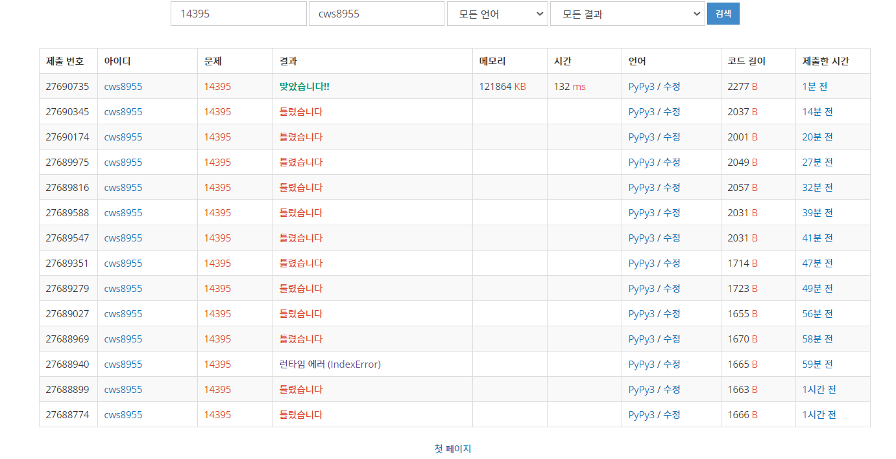

[백준 : 4연산] (https://www.acmicpc.net/problem/14395)


- 간단한 너비우선 탐색 문제
- 그러나 생각하지 못한 점에서 41%위치에서 계속 틀렸습니다가 발생했었다.
- 똑같은 횟수로 목적지에 도착하는 여러 경우가 있을때 cnt를 visit에 그냥 넣으면 하나만 들어가는 오류가 발생했다.
- 예를 들어 1,4 인경우
  - +.* 와 +,+가 들어가고 이중에 순서가 빠른걸 출력해야 한다.
  - 그러나 맨 아래의 코드가 없을 경우 둘 중 하나만 들어가게 된다.

```python
import sys
sys.stdin = open('14395.txt','r')
sys.setrecursionlimit(10**5)
import heapq
from copy import deepcopy

n,m = map(int, input().split())
if n == m:
    print(0)
else:
    answer_lst = []
    visit = set()

    pq = []
    heapq.heappush(pq,[0,n,[]])
    visit.add(n)
    ll = len(pq)

    answer = 0
    stop = True

    while stop and pq:

        ll = len(pq)

        for _ in range(ll):
            cnt,now,lst = heapq.heappop(pq)

            # print(cnt,now,lst)

            if now == m:
                answer = cnt
                answer_lst.append(lst)
                stop = False

            # print(now)
            for k in range(4):
                if k == 0:
                    nxt = now*now
                    if nxt not in visit and 0<= nxt < 1000000001:
                        if nxt != m:
                            visit.add(nxt)
                        temp = deepcopy(lst)
                        temp.append('*')
                        heapq.heappush(pq,[cnt+1,nxt,temp])
                if k == 1:
                    nxt = now+now
                    if nxt not in visit and  0<= nxt < 1000000001:
                        if nxt != m:
                            visit.add(nxt)
                        temp = deepcopy(lst)
                        temp.append('+')
                        heapq.heappush(pq,[cnt+1,nxt,temp])
                if k == 2:
                    nxt = now-now
                    if nxt not in visit and  0<= nxt < 1000000001:
                        if nxt != m:
                            visit.add(nxt)
                        temp = deepcopy(lst)
                        temp.append('-')
                        heapq.heappush(pq,[cnt+1,nxt,temp])
                if k == 3 and now != 0:
                    nxt = 1
                    if nxt not in visit and 0<= nxt < 1000000001:
                        if nxt != m:
                            visit.add(nxt)
                        temp = deepcopy(lst)
                        temp.append('/')
                        heapq.heappush(pq,[cnt+1,nxt,temp])

        
    # print(answer_lst)

    if len(answer_lst)>=1:
        answer_lst = sorted(answer_lst, key=lambda x:x)


    
    if len(answer_lst) == 0:
        print(-1)
    else:
        answerr = answer_lst[0]
        for an in answerr:
            print(an , end ='')
```


```python
if nxt != m:
   visit.add(nxt)

여기가 핵시미 코드이다. m인경우에도 visit에 추가할 경우 위의 1,4인 경우 첫번째에 도착하자마자 visit에 체크되기 때문에 하나만 들어간다. 
```

