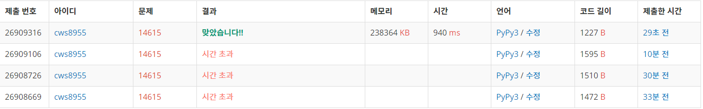

[백준 defend the ctp] (https://www.acmicpc.net/problem/14615)


생각을 잘 못해서 애먹었던 문제


- 처음에는 각 상황마다 bfs를 두 번돌려주었다. 그러다 보니 상황 * 2*bfs 번의 bfs가 돌아졌다.
- 문득 생각해보니 bfs를 1에서 한 번 , n에서 한 번 다른 지점들을 향해 돌려주어 해당 지점이 1에서도 도착할 수 있고 n에서도 도착할 수 있으면 defend 조건이라는 점을 깨달았다.
- 그래서 두번의 bfs를 돌려 각 goo1과 goo2라는 배열을 만들었다.
- 결과적으로 각 상황의 goo1과 goo2가 모두 1이라면 defend 조건이 된다


```python
import sys
sys.stdin = open('14615.txt','r')
from collections import deque

# 요즘 문제풀이 날짜 적는걸 자꾸 까먹는다. 2021.03.03

def go1():
    global n,m,roads,roads2,visit,goo1,goo2

    q = deque()
    q.append(1)
    visit[1] = 1
    goo1[1] = 1

    while q:
        position = q.popleft()

        goo1[position] = 1

        for nxt in roads[position].keys():
            if visit[nxt] == 0:
                visit[nxt] = 1
                q.append(nxt)

    return

def go2():
    global n,m,roads,roads2,visit,goo1,goo2

    q = deque()
    q.append(n)
    visit[n] = 1
    goo2[n] = 1

    while q:
        position = q.popleft()

        goo2[position] = 1

        for nxt in roads2[position].keys():
            if visit[nxt] == 0:
                visit[nxt] = 1
                q.append(nxt)

    return


n,m = map(int, input().split())
roads = {node:{} for node in range(n+1)}
roads2 = {node:{} for node in range(n+1)}

for _ in range(m):
    s,e = map(int ,sys.stdin.readline().split())
    roads[s][e] = 1
    roads2[e][s] = 1

visit = [0]*(n+1)

goo1 = [0]*(n+1)
goo2 = [0]*(n+1)

go1()
visit = [0]*(n+1)
go2()

o = int(input())
for _ in range(o):
    p = int(sys.stdin.readline())
    if goo1[p] == 1 and goo2[p] == 1:
        print("Defend the CTP")
    else:
        print("Destroyed the CTP")
```





