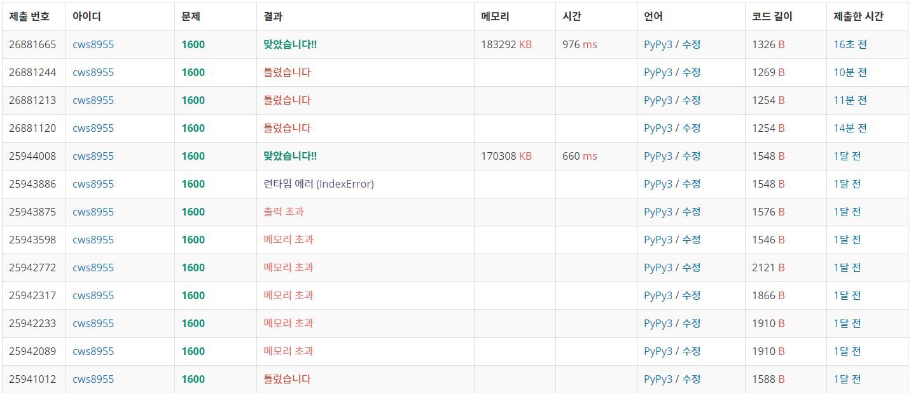

[말이 되고픈 원숭이] (https://www.acmicpc.net/problem/1600)


오늘은 예전문제를 다시 풀어보았다.

사실 새로운 문제도 도전했는데 새로운 문제는 풀지 못했다.... 며칠 후에 그 문제는 다시 도전해야지


일단 말이 되고픈 원숭이!!!!

- 단순 bfs 문제이다.
  - <b>다만 주의할 점은</b> 
    - 1. 3차원 visit으로 방문지를 확인해야함 (y좌표,x좌표,몇번의 말이동)
      2. 말이동과 일반이동은 같은 1회성 이동임을 명심해야함


```python
import sys
sys.stdin = open('1600.txt','r')
from collections import deque
from copy import deepcopy

def bfs():
    global kk,n,m,arr,visit,ans

    q = deque()
    q.append([0,0,0,0])
    visit[0][0][0] = 1

    if m == 1 and n == 1:
        ans = 0
        return 

    while q:
        y,x,h,move = q.popleft()

        if y == n-1 and x == m-1:
            ans = move
            break

        for k in range(8):
            ny = y+hy[k]
            nx = x+hx[k]
            if 0<=ny<n and 0<=nx<m:
                if arr[ny][nx] == 0 and h<kk:
                    if visit[ny][nx][h+1] == 0:
                        visit[ny][nx][h+1] = 1
                        q.append([ny,nx,h+1,move+1])
        
        for k in range(4):
            ny = y+dy[k]
            nx = x+dx[k]
            if 0<=ny<n and 0<=nx<m:
                if arr[ny][nx] == 0:
                    if visit[ny][nx][h] == 0:
                        visit[ny][nx][h] = 1
                        q.append([ny,nx,h,move+1])

    return


hy = [-2,-2,-1,-1,1,1,2,2]
hx = [1,-1,2,-2,2,-2,1,-1]
dy = [0,0,-1,1]
dx = [1,-1,0,0]

kk = int(input())
m,n = map(int, input().split())
arr = []
for _ in range(n):
    arr1 = list(map(int, input().split()))
    arr.append(arr1)

visit = [[[0]*35 for _ in range(m)] for _ in range(n)]
ans = 100000
bfs()

if ans == 100000:
    print(-1)
else:
    print(ans)
```





###### 이번에 새로 풀면서 틀린 이유는 말의 이동횟수를 실수 했다...... 


요즘느끼는건데 풀었던 문제 다시푸는것도 중요한것 같다. 새로움을 추구하되 과거의 것을 읻지 않도록 노력해야겠다