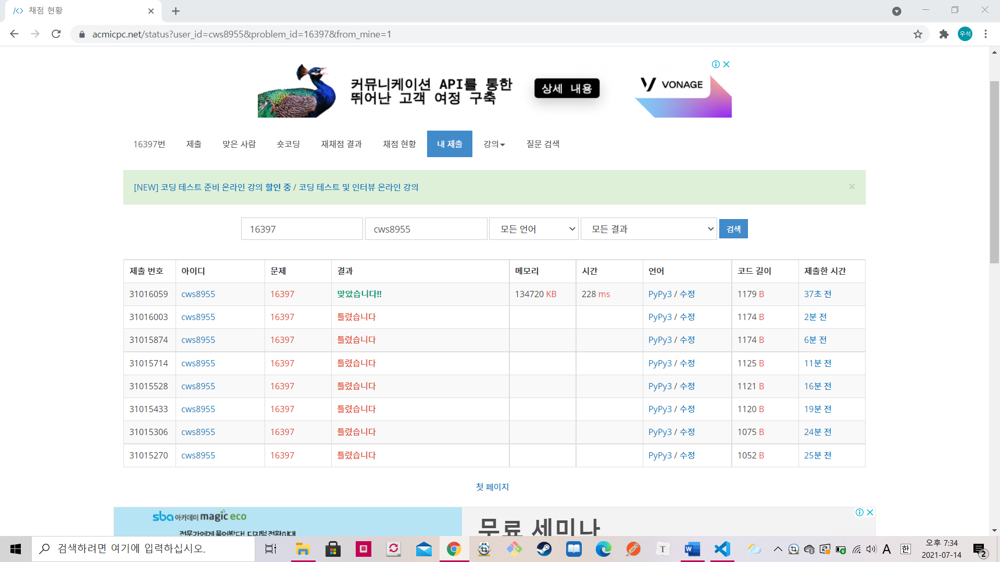

[백준 : 탈출] (https://www.acmicpc.net/problem/16397)


- if문의 위치 때문에 실수해서 시간이 오래걸렸던 문제....
- 단순한 조건형 bfs문제이다.


```python
# if day > t:
#        break
#        
# if now == g:
#    answer = day
#    break 

# 이 두 녀석의 위치를 헷갈려서....


import sys
sys.stdin = open('16397.txt','r')
from collections import deque
input = sys.stdin.readline

n,t,g = map(int, input().split())

q = deque()
visit = [0]*(100000)
answer = False

cnt = 0
q.append([n,0])
visit[n] = 1
while q:
    now,day = q.popleft()

    if day > t:
        break
    
    if now == g:
        answer = day
        break 


    for k in range(2):
        if k == 0:
            if 0<= now+1 <=99999:
                if visit[now+1] == 0:
                    visit[now+1] = 1
                    q.append([now+1,day+1])
        else:
            now2 = now * 2
            noww = now2
            now2 = str(now2)
            now2_lst = list(now2)
            _max = int(now2_lst[0])
            _max -= 1
            now2_lst[0] = _max
            now3 = ''
            for k in range(len(now2_lst)):
                now3 += str(now2_lst[k])
            now3 = int(now3)
            if now3 < 0:
                now3 = 0
            if visit[now3] == 0 and 0<= noww <= 99999 and 0<=now3 <=99999:
                visit[now3] = 1
                q.append([now3,day+1])

if n == g:
    print(0)
else:
    if answer == False:
        print("ANG")
    else:
        print(answer)
        


```

