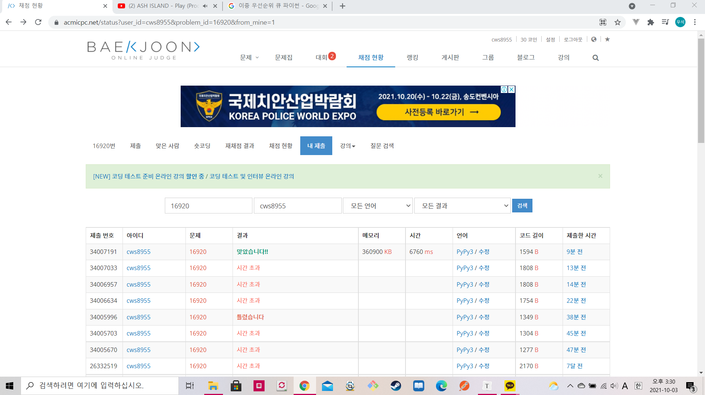

[ 백준 : 확장 게임 ] (https://www.acmicpc.net/problem/16920)


- 옛날에 풀지 못했던 문제를 다시 풀어보았다!!!
- 해결!!!!
- 오늘도 시간초과가 발목을 잡았었는데 이를 heapq를 활용해서 해결했다.


```python
import sys
sys.stdin = open('16920.txt','r')
import heapq
input = sys.stdin.readline

n,m,p = map(int, input().split())
move = [0] + list(map(int, input().split()))
arr = []
for _ in range(n):
    ar = list(input())
    arr.append(ar)


states = [[] for _ in range(p+1)]
end_state = 0
answer = [0] + [0]*p
visit = [[-1]*m for _ in range(n)]
for y in range(n):
    for x in range(m):
        if arr[y][x] != '.' and arr[y][x] != '#':
            arr[y][x] = int(arr[y][x])
            states[arr[y][x]].append([y,x])
            answer[arr[y][x]] += 1

dy = [0,0,-1,1]
dx = [1,-1,0,0]


pq = []

check = False
while True:
    check = False
    for s in range(1,p+1):
        for state in states[s]:
            heapq.heappush(pq,[-move[s],s,state[0],state[1]])
            visit[state[0]][state[1]] = move[s]

        states[s] = []
        while pq:
            move_remain,index,y,x = heapq.heappop(pq)
            move_remain = -move_remain

            if move_remain > 0:
                for k in range(4):
                    ny = y+dy[k]
                    nx = x+dx[k]
                    if 0<=ny<n and 0<=nx<m:
                        if arr[ny][nx] == '.' and visit[ny][nx] == -1:
                            arr[ny][nx] = index
                            visit[ny][nx] = move_remain-1
                            heapq.heappush(pq,[-(move_remain-1),index,ny,nx])
                            answer[index] += 1
                            check = True
            else:
                states[index].append([y,x]) 
    
    if check == False:
        break

    
for ans in answer[1:]:
    print(ans , end = ' ')


```

