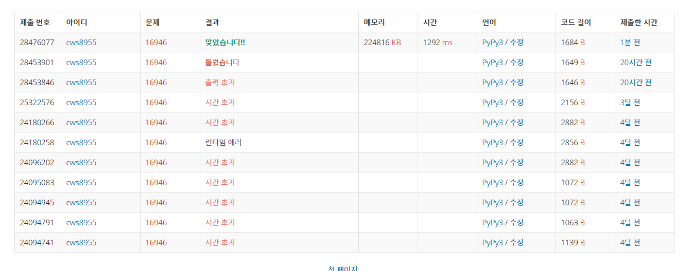

[ 백준 :  벽 부수고 이동하기 4 ] (https://www.acmicpc.net/problem/16946)


- 과거에 도전했을때는 풀지 못했던 문제
- 메모리 제한이 많다는 기준하에 2차원 배열을 다섯개나 만들어서 풀었다.
- 배열 
  - arr :  입력받은 배열
  - visit : plus와 number 배열을 만들 때 중복을 막기 위해 사용한 배열
  - plus: 각 0의 위치가 어떤 숫자를 의미하는지 표현하기 위한 배열
  - number: 각 0의 위치가 어떤 집합에 속했는지  표현하기 위한 배열
  - answer: 답을 출력하는 배열
- 함수
  - setting
    - 빈칸을 기준으로 plus와 number배열을 만드는 함수
  - confirm
    - 벽을 기준으로 각 벽을 부술 경우 몇개의 빈 칸과 연결되는 지 확인하는 함수
    - plus와 number함수가 사용되며 예를 들어 위쪽에 있는 빈칸의 number와 오른쪽에 있는 빈칸의 number가 같을 경우 중복되므로 이를 방지하기 위해 lst 배열을 지역변수로 활용


```python
import sys
sys.stdin = open('16946.txt','r')
from collections import deque

def setting(y,x,ct):
    global n,m,arr,visit,plus,number

    q = deque()
    lst = deque()
    q.append([y,x,ct])
    lst.append([y,x,ct])
    visit[y][x] = 1

    result = 1

    while q:
        y,x,ct = q.popleft()

        for k in range(4):
            ny = y+dy[k]
            nx = x+dx[k]
            if 0<=ny<n and 0<=nx<m:
                if arr[ny][nx] == 0 and visit[ny][nx] == 0:
                    visit[ny][nx] = 1
                    result += 1
                    q.append([ny,nx,ct])
                    lst.append([ny,nx,ct])

    while lst:
        y,x,ct = lst.popleft()

        visit[y][x] = 1
        number[y][x] = ct
        plus[y][x] = result

    return

def confirm(y,x):
    global n,m,arr,visit,plus,number,answer

    result = 1

    lst = []

    for k in range(4):
        ny = y+dy[k]
        nx = x+dx[k]
        if 0<=ny<n and 0<=nx<m:
            if number[ny][nx] not in lst:
                lst.append(number[ny][nx])
                result += plus[ny][nx]

    answer[y][x] = result%10

    return

dy = [-1,1,0,0]
dx = [0,0,-1,1]

n,m = map(int, input().split())
arr = []
for _ in range(n):
    arr1 = list(map(int, input()))
    arr.append(arr1)

visit = [[0]*m for _ in range(n)]
plus = [[0]*m for _ in range(n)]
number = [[0]*m for _ in range(n)]
answer = [[0]*m for _ in range(n)]

cnt = 1
for y in range(n):
    for x in range(m):
        if arr[y][x] == 0 and visit[y][x] == 0:
            setting(y,x,cnt)
            cnt += 1

for y in range(n):
    for x in range(m):
        if arr[y][x] == 1:
            confirm(y,x)

for ans in answer:
    for an in ans:
        print(an, end = '')
    print()
```

