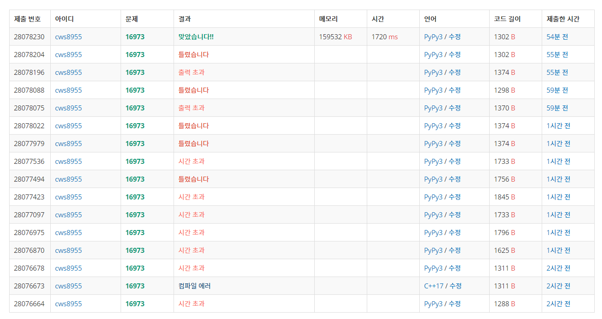

[백준 : 직사각형 탈출] (https://www.acmicpc.net/problem/16973)


##### 2021.04.06


- 시간초과에 많이 힘들었던 문항
- 로직
  - 처음에 벽을 모두 walls라는 리스트에 넣는다.
  - 벽이 있을 경우 벽을 기준으로 범위안의 2사분면에 있는 모든 공간은 이동이 불가능하므로 visit처리를 한다.
  - 그 후에 범위조건을 지키는 하에 해당 위치로 이동 가능한지를 판단한다.


- ```python
  import sys
  sys.stdin = open('16973.txt','r')
  from collections import deque
  import heapq
  
  def obstacle():
      global n,m,arr,w,h,sy,sx,ey,ex,answer,visit,walls
  
      while walls:
          y,x = walls.popleft()
  
          for yy in range(y-w+1,y+1):
              for xx in range(x-h+1,x+1):
                  visit[yy][xx] = 1
  
      return
  
  def bfs():
      global n,m,arr,w,h,sy,sx,ey,ex,answer,visit,walls
  
      pq = []
      heapq.heappush(pq,[0,sy,sx])
      visit[sy][sx] = 1
  
      while pq:
          cnt,y,x = heapq.heappop(pq)
  
          if y == ey and x == ex:
              answer =cnt
              break
  
          for k in range(4):
              ny = y+dy[k]
              nx = x+dx[k]
              if 0<=ny<n-w+1 and 0<=nx<m-h+1:
                  if visit[ny][nx] == 0:
                      visit[ny][nx] = 1
                      heapq.heappush(pq,[cnt+1,ny,nx])
  
      return
  
  
  dy = [-1,1,0,0]
  dx = [0,0,-1,1]
  n,m = map(int, input().split())
  arr = []
  for _ in range(n):
      arr1 = list(map(int, input().split()))
      arr.append(arr1)
  
  w,h,sy,sx,ey,ex = map(int, input().split())
  sy -= 1
  sx -= 1
  ey -= 1
  ex -= 1
  
  visit = [[0]*m for _ in range(n)]
  
  walls = deque()
  
  for y in range(n):
      for x in range(m):
          if arr[y][x] == 1:
              walls.append([y,x])
  
  obstacle()
  
  # for vi in visit:
  #     for v in vi:
  #         print(v, end=' ')
  #     print()
  
  answer = 9876543210
  
  bfs()
  
  if answer == 9876543210:
      print(-1)
  else:
      print(answer)
  ```

  


- 