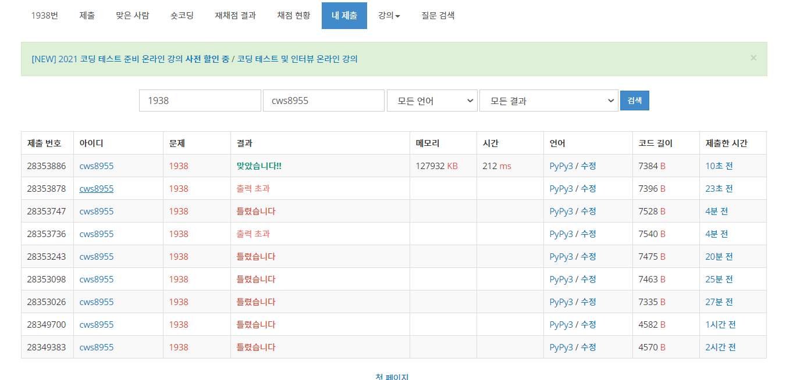

[백준 : 통나무 옮기기] (https://www.acmicpc.net/problem/1938)


##### 2021.04.14


- 정말 너무나도 힘겹게 푼 문제

- 사소한 오타 하나때문에 한 시간 가량을 날렸다.

- 로직

  - 자료구조
    - visit배열은 이동여부를 체크하는 배열 (y,x,통나무의 방향)
    - turn은 회전이 금지된 구역
  - 함수
    - setting 
      - '1'의 값을 가지고 있는 arr위치 기준으로 자신 포함 8방향의 turn값을 1로 바꿔줌 (회전 불가영역)
    - go
      - 각 상황에서 통나무가 이동하거나 회전하는 함수
      - 이동할 경우 중심이 아닌 양옆의 통나무가 범위를 넘거나 1에 부딫히나 체크해주는 함수 confirm을 추가적으로 활용해주면서 confirm의 리턴값이 true일 경우 이동

  


```python
import sys
sys.stdin = open('1938.txt','r')
from collections import deque
from copy import deepcopy

def setting():
    global set_lst,n,visit,turn

    ll = len(set_lst)
    for ls in range(ll):
        y,x = set_lst.popleft()

        visit[y][x][0] = 1
        visit[y][x][1] = 1
        turn[y][x][0] = 1
        turn[y][x][1] = 1

        for k in range(8):
            ny = y+dy[k]
            nx = x+dx[k]
            if 0<=ny<n and 0<=nx<n:
                turn[ny][nx][0] = 1
                turn[ny][nx][1] = 1
            
    
    return

def go():
    global n,arr,visit,by1,bx1,ey1,ex1,b_state,e_state,answer,turn

    q = deque()
    visit[by1][bx1][b_state] = 1
    q.append([by1,bx1,b_state,0])

    while q:
        y,x,s,move = q.popleft()

        # print(y,x,s,move)

        if y==ey1 and x == ex1 and s == e_state:
            answer = move 
            break

        for k in range(5):

            if k == 0: # 위
                ny = y-1
                nx = x
                if 0<=ny<n and 0<=nx<n:
                    if s == 0:
                        if visit[ny][nx][s] == 0:
                            ans = confirm(y,x,s,k)
                            if ans == True:
                                visit[ny][nx][s] = 1
                                q.append([ny,nx,s,move+1])
                    elif s == 1:
                        if 0<ny<n:
                            if visit[ny][nx][s] == 0:
                                ans = confirm(y,x,s,k)
                                if ans == True:
                                    visit[ny][nx][s] = 1
                                    q.append([ny,nx,s,move+1])
            
            elif k == 1: # 아래
                ny = y+1
                nx = x
                if 0<=ny<n and 0<=nx<n:
                    if s == 0:
                        if visit[ny][nx][s] == 0:
                            ans = confirm(y,x,s,k)
                            if ans == True:
                                visit[ny][nx][s] = 1
                                q.append([ny,nx,s,move+1])
                    elif s == 1:
                        if 0<=ny<n-1:
                            if visit[ny][nx][s] == 0:
                                ans = confirm(y,x,s,k)
                                if ans == True:
                                    visit[ny][nx][s] = 1
                                    q.append([ny,nx,s,move+1])
            
            elif k == 2: # 왼쪽 
                ny = y
                nx = x-1
                if 0<=ny<n and 0<=nx<n:
                    if s == 0:
                        if 0<nx<n:
                            if visit[ny][nx][s] == 0:
                                ans = confirm(y,x,s,k)
                                if ans == True:
                                    visit[ny][nx][s] = 1
                                    q.append([ny,nx,s,move+1])
                    elif s == 1:
                        if visit[ny][nx][s] == 0:
                            ans = confirm(y,x,s,k)
                            if ans == True:
                                visit[ny][nx][s] = 1
                                q.append([ny,nx,s,move+1])

            elif k == 3: # 오른쪽
                ny = y
                nx = x+1
                if 0<=ny<n and 0<=nx<n:
                    if s == 0:
                        if 0<nx<n-1:
                            if visit[ny][nx][s] == 0:
                                ans = confirm(y,x,s,k)
                                if ans == True:
                                    visit[ny][nx][s] = 1
                                    q.append([ny,nx,s,move+1])
                    elif s == 1:
                        # print(ny,nx,s,move)
                        if visit[ny][nx][s] == 0:
                            ans = confirm(y,x,s,k)
                            # print(ans)
                            if ans == True:
                                # print(ny,nx,s,move)
                                visit[ny][nx][s] = 1
                                q.append([ny,nx,s,move+1])

            elif k == 4:
                if s == 0:
                    if 0<=y+1<n and 0<=y-1<n:
                        if visit[y][x][1] == 0 and turn[y][x][1] == 0:
                            visit[y][x][1] = 1
                            q.append([y,x,1,move+1])
                if s == 1:
                    if 0<=x+1<n and 0<=x-1<n:
                        if visit[y][x][0] == 0 and turn[y][x][0] == 0:
                            visit[y][x][0] = 1
                            q.append([y,x,0,move+1])

    return
            
def confirm(y,x,s,k):
    global arr,visit


    if s == 1:
        if k == 0:
            # print('-----')
            if 0<=y-2<n:
                if arr[y-2][x] !='1':
                    return True
        elif k == 1:
            # print('-----')
            if 0<=y+2<n:
                if arr[y+2][x] !='1':
                    # print('======')
                    return True
        elif k == 2:
            # print('-----')
            if 0<=x-1<n and 0<=y-1<n and 0<=y+1<n:
                if arr[y][x-1] !='1' and arr[y-1][x-1] != '1' and arr[y+1][x-1] !='1':
                    return True
        elif k == 3:
            if 0<=x+1<n and 0<=y-1<n and 0<=y+1<n:
                if arr[y][x+1] !='1' and arr[y-1][x+1] != '1' and arr[y+1][x+1] !='1':
                    return True


    if s == 0:
        if k == 0:
            if 0<=y-1<n and 0<=x-1<n and 0<=x+1<n:
                if arr[y-1][x] !='1' and arr[y-1][x-1] != '1' and arr[y-1][x+1] != '1':
                    return True
        elif k == 1:
            if 0<=y+1<n and 0<=x-1<n and 0<=x+1<n:
                if arr[y+1][x] !='1' and arr[y+1][x-1] != '1' and arr[y+1][x+1] != '1':
                    return True
        elif k == 2:
            if 0<=x-2<n:
                if arr[y][x-2] != '1':
                    return True
        elif k == 3:
            if 0<=x+2<n:
                if arr[y][x+2] != '1':
                    return True


    return False


dy = [-1,-1,-1,0,0,1,1,1]
dx = [-1,0,1,-1,1,-1,0,1]

n = int(input())
arr = []
for _ in range(n):
    arr1 = list(input())
    arr.append(arr1)

visit = [[[0]*2 for _ in range(n)]for _ in range(n)]
turn = [[[0]*2 for _ in range(n)]for _ in range(n)]

by0,by1,by2,bx0,bx1,bx2 = None,None,None,None,None,None
ey0,ey1,ey2,ex0,ex1,ex2 = None,None,None,None,None,None

set_lst = deque()

for y in range(n):
    for x in range(n):
        if arr[y][x] == 'B' and by0 == None and bx0 == None:
            by0 = y
            bx0 = x
        elif arr[y][x] == 'B' and by1 == None and bx1 == None:
            by1 = y
            bx1 = x
        elif arr[y][x] == 'B' and by2 == None and bx2 == None:
            by2 = y
            bx2 = x
        elif arr[y][x] == 'E' and ey0 == None and ex0 == None:
            ey0 = y
            ex0 = x
        elif arr[y][x] == 'E' and ey1 == None and ex1 == None:
            ey1 = y
            ex1 = x
        elif arr[y][x] == 'E' and ey2 == None and ex2 == None:
            ey2 = y
            ex2 = x
        elif arr[y][x] == '1':
            set_lst.append([y,x])


b_state = None
e_state = None

if by0 == by1:
    b_state = 0
else:
    b_state = 1

if ey0 == ey1:
    e_state = 0
else:
    e_state = 1

answer = 0
setting()
go()
# print(b_state)
print(turn)
# print(type(arr[3][0]))
print(answer)


```

