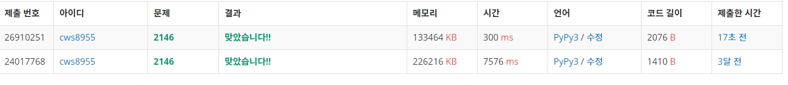

[백준 다리만들기]         (https://www.acmicpc.net/problem/2146)


예전에 풀었던 문제 하나를 다시 풀어보았다.


로직은 다음과 같다.

	1. <b>섬을 만든다: 각 섬의 숫자는 다르게 이루어지도록 한다</b>
	2. <b>만들어진 섬에서 bfs로 다른 섬을 향한다</b>
	 - 주의할 점
	 - 하나의 섬에서는 한 번만 출발하면 된다. 아래의 코드를 보면 이를 해결하는 코드는 visit 코드이다.
	 - confirm 코드는 bfs 이동중의 중복을 막기위함이며 , visit은 시작한 섬에서 또 시작할 필요를 없애기 위한 코드


```python
import sys
sys.stdin = open('2146.txt','r')
from collections import deque
import heapq

# 2021.03.03

def setting(cn,y,x):
    global n,arr,visit,lands

    q = deque()
    q.append([y,x])
    visit[y][x] = 1
    lands[y][x] = cn

    while q:
        y,x = q.popleft()

        for k in range(4):
            ny = y+dy[k]
            nx = x+dx[k]
            if 0<=ny<n and 0<=nx<n:
                if visit[ny][nx] == 0 and arr[ny][nx] == 1:
                    visit[ny][nx] = 1
                    lands[ny][nx] = cn
                    q.append([ny,nx])

    return

def bfs(y,x,me):
    global n,arr,visit,lands,ans,confirm

    pq = []
    heapq.heappush(pq,[0,y,x])
    visit[y][x] = 1
    confirm[y][x] = 1

    while pq:
        cnt,y,x = heapq.heappop(pq)

        if lands[y][x] != 0 and lands[y][x] != me:
            if ans > cnt:
                ans = cnt
            break

        for k in range(4):
            ny = y+dy[k]
            nx = x+dx[k]
            if 0<=ny<n and 0<=nx<n:
                if lands[ny][nx] == me:
                    visit[ny][nx] = 1
                if confirm[ny][nx] == 0:
                    confirm[ny][nx] = 1
                    if lands[ny][nx] == 0:
                        heapq.heappush(pq,[cnt+1,ny,nx])
                    if lands[ny][nx] == me:
                        heapq.heappush(pq,[cnt,ny,nx])
                    if lands[ny][nx] != 0 and lands[ny][nx] != me:
                        heapq.heappush(pq,[cnt,ny,nx])

    return


dy = [0,0,-1,1]
dx = [1,-1,0,0]

n = int(input())
arr = []
for _ in range(n):
    arr1 = list(map(int, input().split()))
    arr.append(arr1)

visit = [[0]*n for _ in range(n)]
lands = [[0]*n for _ in range(n)]
confirm = [[0]*n for _ in range(n)]

cn = 1
for y in range(n):
    for x in range(n):
        if arr[y][x] == 1 and visit[y][x] == 0:
            setting(cn,y,x)
            cn += 1
ans = 10000

visit = [[0]*n for _ in range(n)]

for y in range(n):
    for x in range(n):
        if visit[y][x] == 0 and lands[y][x] != 0:
            bfs(y,x,lands[y][x])
            confirm = [[0]*n for _ in range(n)]


print(ans)
```





과거에 짠 코드보다 효율성이 훨씬 좋다!!!!!!