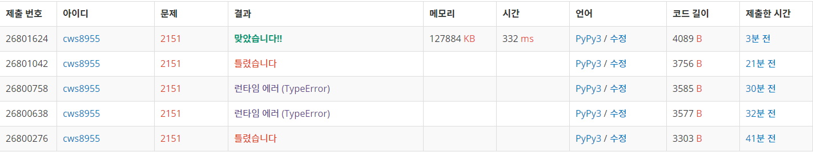

[거울설치] (https://www.acmicpc.net/problem/2151)


```python
# 문제 풀이 -> 2021.02.27

# 단순한 + 조금 생각할 거리가 있는 bfs문제
# 다만 헷갈릴 포인트가 여러개 존재
# 1. 거울을 마주치면 빛이 90도 꺾인다
# 2. 거울을 꼭 다 설치할 필요없다(거울 설치 지역이지만 그냥 지나가게 해도됨)
# 3. 우선순위 큐를 활용하여 거울의 설치숫자가 적은 수부터 bfs가 돌도록 설계


import sys
sys.stdin = open('2151.txt','r')
from collections import deque
import heapq

def bfs():
    global n,arr,visit,ans

    pq = []
    heapq.heappush(pq,[0,sy,sx,0])
    heapq.heappush(pq,[0,sy,sx,1])
    heapq.heappush(pq,[0,sy,sx,2])
    heapq.heappush(pq,[0,sy,sx,3])
    visit[sy][sx][0] = 1
    visit[sy][sx][1] = 1
    visit[sy][sx][2] = 1
    visit[sy][sx][3] = 1

    while pq:
        m,y,x,d = heapq.heappop(pq)

        if y == ey and x == ex:
            ans = m
            break

        if d == 0:
            if 0<=y-1<n:
                if arr[y-1][x]== '.':
                    if visit[y-1][x][d] == 0:
                        visit[y-1][x][d] = 1
                        heapq.heappush(pq,[m,y-1,x,d])
                elif arr[y-1][x] == '!':
                    if visit[y-1][x][d] == 0:
                        visit[y-1][x][d] = 1
                        heapq.heappush(pq,[m+1,y-1,x,2])
                        heapq.heappush(pq,[m+1,y-1,x,3])
                        heapq.heappush(pq,[m,y-1,x,d])
                elif arr[y-1][x] == '#':
                    if visit[y-1][x][d] == 0:
                        visit[y-1][x][d] = 1
                        heapq.heappush(pq,[m,y-1,x,d])

        if d == 1:
            if 0<=y+1<n:
                if arr[y+1][x] == '.':
                    if visit[y+1][x][d] == 0:
                        visit[y+1][x][d] = 1
                        heapq.heappush(pq,[m,y+1,x,d])
                elif arr[y+1][x] == '!':
                    if visit[y+1][x][d] == 0:
                        visit[y+1][x][d] = 1
                        heapq.heappush(pq,[m+1,y+1,x,2])
                        heapq.heappush(pq,[m+1,y+1,x,3])
                        heapq.heappush(pq,[m,y+1,x,d])
                elif arr[y+1][x] == '#':
                    if visit[y+1][x][d] == 0:
                        visit[y+1][x][d] = 1
                        heapq.heappush(pq,[m,y+1,x,d])

        if d == 2:
            if 0<=x-1<n:
                if arr[y][x-1] == '.':
                    if visit[y][x-1][d] == 0:
                        visit[y][x-1][d] = 1
                        heapq.heappush(pq,[m,y,x-1,d])
                elif arr[y][x-1] == '!':
                    if visit[y][x-1][d] == 0:
                        visit[y][x-1][d] = 1
                        heapq.heappush(pq,[m+1,y,x-1,0])
                        heapq.heappush(pq,[m+1,y,x-1,1])
                        heapq.heappush(pq,[m,y,x-1,d])
                elif arr[y][x-1] == '#':
                    if visit[y][x-1][d] == 0:
                        visit[y][x-1][d] = 1
                        heapq.heappush(pq,[m,y,x-1,d])

        if d == 3:
            if 0<=x+1<n:
                if arr[y][x+1] == '.':
                    if visit[y][x+1][d] == 0:
                        visit[y][x+1][d] = 1
                        heapq.heappush(pq,[m,y,x+1,d])
                elif arr[y][x+1] == '!':
                    if visit[y][x+1][d] == 0:
                        visit[y][x+1][d] = 1
                        heapq.heappush(pq,[m+1,y,x+1,0])
                        heapq.heappush(pq,[m+1,y,x+1,1])
                        heapq.heappush(pq,[m,y,x+1,d])
                elif arr[y][x+1] == '#':
                    if visit[y][x+1][d] == 0:
                        visit[y][x+1][d] = 1
                        heapq.heappush(pq,[m,y,x+1,d])

    return


dy = [-1,1,0,0]
dx = [0,0,-1,1]


n = int(input())
arr = []
for _ in range(n):
    arr1 = list(input())
    arr.append(arr1)

sy,sx,ey,ex = 10000,10000,10000,10000

for y in range(n):
    for x in range(n):
        if arr[y][x] == '#' and sy == 10000 and sx == 10000:
            sy = y
            sx = x
        elif arr[y][x] == '#' and sy != 10000 and sx != 10000:
            ey = y
            ex = x

visit = [[[0]*4 for _ in range(n)]for _ in range(n)]
ans = 0
bfs()

print(ans)


```


###### 중복된 내용을 조금 더 간편하게 하는 코드 효율화가 필요할듯. 코드가 너무 지저분하다

