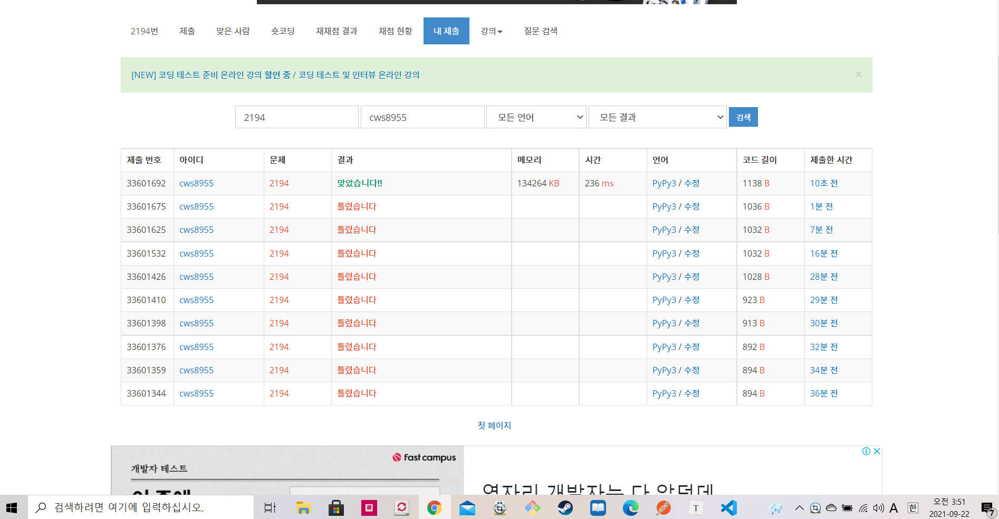

[ 백준 : 유닛 이동시키기 ] (https://www.acmicpc.net/problem/2194)


- 간단한 bfs문제
- 장애물을 통해 이동할 수 없는 영역을 체킹해준다.
- 해당영역을 피해서 도착할 수 있는지 유무를 파악한다.
- 오타때문에....... 계속 틀렸었다.


```python
import sys
sys.stdin = open('2194.txt','r')
from collections import deque

n,m,a,b,k = map(int, input().split())
arr = [[0]*(m+1) for _ in range(n+1)]

for _ in range(k):
    y,x = map(int,input().split())

    for yy in range(-a,0,1):
        for xx in range(-b,0,1):
            if 1<=y+yy+1<n+1 and 1<=x+xx+1<m+1:
                arr[y+yy+1][x+xx+1] = 1


# for ar in arr:
#     for ss in ar:
#         print(ss, end='')
#     print()
    
q = deque()
visit = [[0]*(m+1) for _ in range(n+1)]

answer = None
sy,sx = map(int,input().split())
ey,ex = map(int,input().split())
q.append([sy,sx,0])

dy = [0,0,1,-1]
dx = [1,-1,0,0]
visit[sy][sx] = 1

if arr[sy][sx] == 1:
    print(-1)
else:
    while q:
        y,x,cnt = q.popleft()
        # print(y,x)

        if y == ey and x == ex:
            answer = cnt
            break

        for k in range(4):
            ny = y+dy[k]
            nx = x+dx[k]
            if 1<=ny<=n-a+1 and 1<=nx<=m-b+1: 
                if visit[ny][nx] == 0 and arr[ny][nx] == 0:
                    visit[ny][nx] = 1
                    q.append([ny,nx,cnt+1])


    if answer == None:
        print(-1)
    else:
        print(answer)

```

