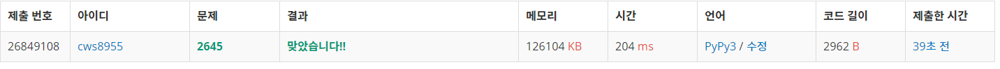

[백준 - 회로배치] (https://www.acmicpc.net/problem/2645)


###### 1. 플래티넘 문제치고는 상당히 쉬웠던 문제

###### 2. 처음에 deque쓰려다가 시간이나 메모리 터질것 같아서 heapq로 바꿔준게 그나마 포인트


```python
import sys
sys.stdin = open('2645.txt','r')
from collections import deque
from copy import deepcopy
import heapq

def setting(brr):
    global n,arr,visit,arr

    crr = brr[1:]
    mm = brr[0]

    for k in range(mm-1):
        sett(crr[2*k],crr[(2*k)+1],crr[2*(k+1)],crr[(2*(k+1))+1])

    return

def sett(ssy,ssx,eey,eex):
    global n,arr,visit,arr

    if ssy == eey:
        if ssx > eex:
            for g in range(ssx,eex-1,-1):
                arr[eey][g] = 1
        elif ssx < eex:
            for g in range(ssx,eex+1):
                arr[eey][g] = 1

    if ssx == eex:
        if ssy > eey:
            for g in range(ssy,eey-1,-1):
                arr[g][eex] = 1
        elif ssy < eey:
            for g in range(ssy,eey+1):
                arr[g][eex] = 1

    return

def bfs():
    global n,arr,wt,ans,sy,sx,ey,ex,ans_lst

    # q = deque()
    # q.append([sy,sx,1,[[sy,sx]]])
    pq = []
    heapq.heappush(pq,[1,sy,sx,0,[[sy,sx]]])
    heapq.heappush(pq,[1,sy,sx,1,[[sy,sx]]])
    heapq.heappush(pq,[1,sy,sx,2,[[sy,sx]]])
    heapq.heappush(pq,[1,sy,sx,3,[[sy,sx]]])
    visit[sy][sx] = 1

    while pq:
        cnt,y,x,d,lst = heapq.heappop(pq)

        if y == ey and x == ex:
            lst.append([ey,ex])
            # if arr[ey][ex] == 1:
            #     cnt += wt
            # else:
            #     cnt += 1
            
            ans = cnt
            ans_lst = deepcopy(lst)
            break

        for kk in range(4):
            ny = y+dy[kk]
            nx = x+dx[kk]
            if 1<=ny<n+1 and 1<=nx<n+1:
                if visit[ny][nx] == 0:
                    if d == kk:
                        if arr[ny][nx] == 0:
                            visit[ny][nx] = 1
                            heapq.heappush(pq,[cnt+1,ny,nx,kk,lst])
                        else:
                            visit[ny][nx] = 1
                            heapq.heappush(pq,[cnt+wt,ny,nx,kk,lst])
                    else:
                        if arr[ny][nx] == 0:
                            visit[ny][nx] = 1
                            temp = deepcopy(lst)
                            temp.append([y,x])
                            heapq.heappush(pq,[cnt+1,ny,nx,kk,temp])
                        else:
                            visit[ny][nx] = 1
                            temp = deepcopy(lst)
                            temp.append([y,x])
                            heapq.heappush(pq,[cnt+wt,ny,nx,kk,temp])

    return

dy = [-1,1,0,0]
dx = [0,0,-1,1]
n = int(input())
arr = []
arr.append([0]*(n+1))
for _ in range(n):
    arr1 = [0]*(n+1)
    arr.append(arr1)

sy,sx,ey,ex = map(int, input().split())
wt = int(input())
m = int(input())
visit = [[0]*(n+1) for _ in range(n+1)]
for _ in range(m):
    brr = list(map(int, input().split()))
    setting(brr)
    visit = [[0]*(n+1) for _ in range(n+1)]


# for ar in arr:
#     for a in ar:
#         print(a, end = ' ')
#     print()

ans = 0
ans_lst = []
bfs()


if ans_lst[0] == ans_lst[1]:
    ans_lst = ans_lst[1:]

print(ans)
print(len(ans_lst), end = ' ')

for an in ans_lst:
    for a in an:
        print(a, end=' ')


```




###### 다익스트라로도 풀어봐야겠다

