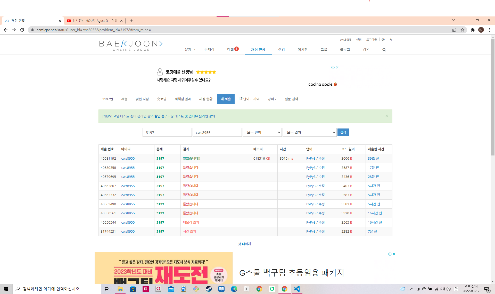

백조의 호수 (https://www.acmicpc.net/problem/3197)


- 와 은근히 빡셌다.... 
- 분리집합과 너비 우선 탐색을 함께 사용했다.


- 1500 * 1500의 모든 각 영역을 처음에는 다른 집합으로 만든 후
- 물웅덩이로 연결된 집합들은 하나의 집합으로 합친다. (주의 : 백조가 있는 물웅덩이의 경우 백조의 번호로 집합변형)
- 물웅덩이를 기점으로 얼음영역까지 너비우선탐색과 동시에 분리집합 연결
- 첫 번째 백조의 집합과, 두 번째 백조의 집합이 처음 만날 때의 날짜가 정답 (union을 시키기 때문에 한 번 밖에 못 만나기도 함)
- 두 개의 개념이 응축 + 구현 디테일 `쉽지 않았다!!!!!!`


```python
import sys
sys.stdin = open('3197.txt','r')
sys.setrecursionlimit(10**5)
from collections import deque


def find(x):
    if parent[x] == x:
        return x
    parent[x] = find(parent[x])
    return parent[x]

def union(a,b):

    rootA = find(a)
    rootB = find(b)

    parent[rootB] = rootA

def settingBFS(initY, initX):

    queue = deque()
    visit[initY][initX] = True
    queue.append([initY, initX])

    while queue:
        y,x = queue.popleft()

        for k in range(4):
            ny = y + dy[k]
            nx = x + dx[k]
            if 0 <= ny < height and 0<= nx < width:
                if visit[ny][nx] == False and lakes[ny][nx] != 'X':
                    nowParent = (y * width) + x
                    nxtParent = (ny * width) + nx 
                    visit[ny][nx] = True

                    if [ny,nx] in swanPosition:
                        union(nxtParent, nowParent)
                    else: 
                        union(nowParent, nxtParent)

                    queue.append([ny,nx])

    return

def finalBFS():
    global answer

    queue = deque()
    for y in range(height):
        for x in range(width):
            if lakes[y][x] != 'X':
                queue.append([y,x,1])
                visit[y][x] = 0

    while queue:
        y,x,day = queue.popleft()
        flag = False

        for k in range(4):
            ny = y + dy[k]
            nx = x + dx[k]
            if 0 <= ny < height and 0 <= nx < width:
                if lakes[ny][nx] == 'X':
                    if visit[ny][nx] >= day:
                        visit[ny][nx] = day

                    nowParent = (y * width) + x
                    nxtParent = (ny * width) + nx 
                    
                    findNowParent = find(nowParent)
                    findNxtParent = find(nxtParent)

                    if findNowParent != findNxtParent:
                        if findNowParent in swanParent and findNxtParent in swanParent:
                            if day > visit[ny][nx]:
                                answer = day - 1
                            else:
                                answer = day
                            flag = True
                            break
                        elif findNowParent not in swanParent and findNxtParent in swanParent:
                            union(nxtParent, nowParent)
                        elif findNowParent in swanParent and findNxtParent not in swanParent:
                            union(nowParent, nxtParent)
                        else:
                            union(nowParent, nxtParent)

                        queue.append([ny,nx,day+1])

        if flag == True:
            break
    
    return


 


height, width = map(int, input().split())
lakes = []
for _ in range(height):
    lakeRow = list(input())
    lakes.append(lakeRow)

parent = [i for i in range(height * width)]

visit = [[False] * width for _ in range(height)]

swanPosition = []

dy = [0,0,-1,1]
dx = [-1,1,0,0]

# 1차 BFS : 초기 물 집합

for y in range(height):
    for x in range(width):
        if lakes[y][x] == 'L':
            swanPosition.append([y,x])

for y in range(height):
    for x in range(width):
        if visit[y][x] == False and lakes[y][x] != 'X':
            settingBFS(y,x)

INF = float('inf')

visit = [[INF] * width for _ in range(height)]
swanParent = []

firstSwan = (swanPosition[0][0] * width) + swanPosition[0][1]
secondSwan = (swanPosition[1][0] * width) + swanPosition[1][1]

swanParent.append(find(firstSwan))
swanParent.append(find(secondSwan))

answer = INF

# 2차 BFS : 얼음꺠기
finalBFS()

print(answer)
```


