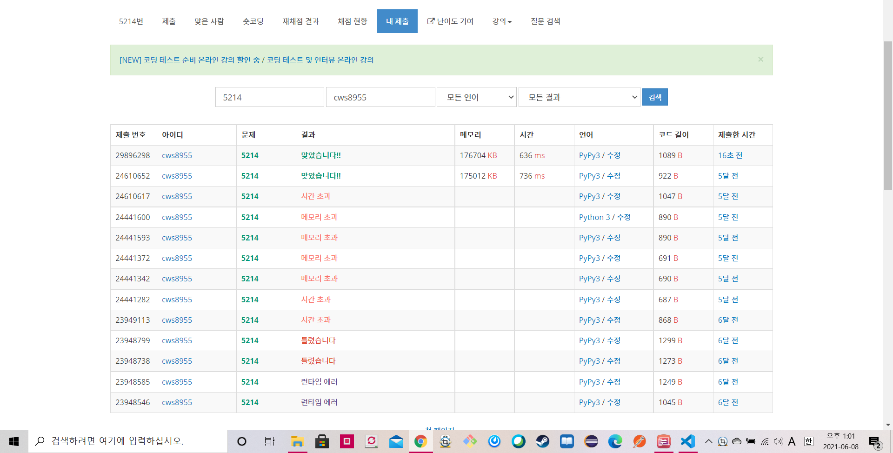

[백준 : 환승] (https://www.acmicpc.net/problem/5214)


- 과거에 풀었던 문제를 다시 풀어보았다.
- 쉽게 풀었다.
- 역에서 튜브로 가는 방법 stations
- 튜브에서 역으로 가는 방법 tubes
- 역의 중복 방지 , 튜브의 중복방지 등을 활용해 풀었다.


```python
import sys
sys.stdin = open('5214.txt','r')
from collections import deque

def bfs():
    global n,c,k,stations,tubes,visit_stations,visit_tubes

    q = deque()
    visit_stations[1] = 1
    q.append([1,1])

    while q:
        now_station,number = q.popleft()

        if now_station == n:
            return number

        for nxt_tube in stations[now_station]:
            if visit_tubes[nxt_tube] == 0:
                visit_tubes[nxt_tube] = 1
                for nxt_station in tubes[nxt_tube]:
                    if visit_stations[nxt_station] == 0:
                        visit_stations[nxt_station] = 1
                        q.append([nxt_station,number+1])

    return False

n,c,k = map(int, input().split())
stations = [[] for _ in range(n+1)]
tubes = [[]]

for s in range(1,k+1):
    tube = list(map(int, input().split()))
    tubes.append(tube)
    for tu in tube:
        stations[tu].append(s)

visit_stations = [0]*(n+1)
visit_tubes = [0]*(k+1)

# print(stations)
# print(tubes)
# print(visit_stations)
# print(visit_tubes)

answer = bfs()

if answer == False:
    print(-1)
else:
    print(answer)

```



