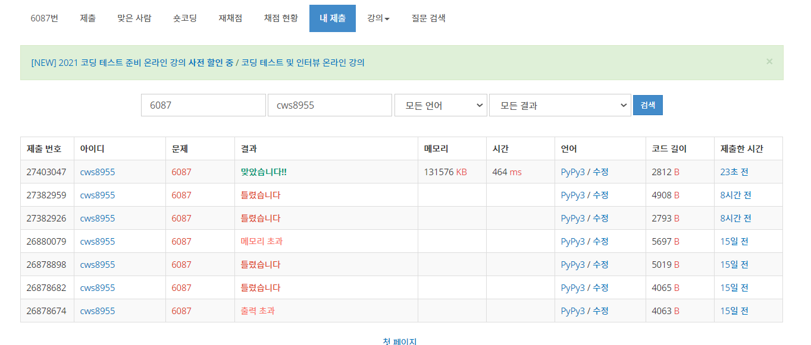

[백준 : 레이저통신] (https://www.acmicpc.net/problem/6087)


- 로직
- 레이저는 처음에 4방향으로 쏴지며 레이저가 도달한 칸이 빈칸일 경우 1) 그방향 그대로 계속 넣어주기 , 2) 오른쪽 90도 꺾어주고 cnt +1 해주기 , 3) 왼쪽 90도 꺾어주고 cnt+1 해주기 이런식으로 heapq에 넣어주며서 y좌표 , x좌표 , 레이저가 도달한 방향이 저장된 4차원 visit을 활용해준다.


```python
import sys
sys.stdin = open('6087.txt','r')
import heapq

def bfs():
    global n,m,arr,visit,sy,sx,ey,ex,ans

    pq = []
    heapq.heappush(pq,[0,0,sy,sx])
    heapq.heappush(pq,[0,1,sy,sx])
    heapq.heappush(pq,[0,2,sy,sx])
    heapq.heappush(pq,[0,3,sy,sx])

    while pq:
        cnt,d,y,x = heapq.heappop(pq)
        # print(cnt,d,y,x)

        if y == ey and x == ex:
            ans = cnt
            break

        if d == 0:
            ny = y-1
            nx = x
            if 0<=ny<n and 0<=nx<m:
                if visit[ny][nx][d] == 0 and (arr[ny][nx] == '.' or (ny==ey and nx == ex)):
                    visit[ny][nx][d] = 1
                    # visit[ny][nx][2] = 1
                    # visit[ny][nx][3] = 1
                    heapq.heappush(pq,[cnt,d,ny,nx])
                    heapq.heappush(pq,[cnt+1,2,ny,nx])
                    heapq.heappush(pq,[cnt+1,3,ny,nx])
        elif d == 1:
            ny = y+1
            nx = x
            if 0<=ny<n and 0<=nx<m:
                if visit[ny][nx][d] == 0 and (arr[ny][nx] == '.' or (ny==ey and nx == ex)):
                    visit[ny][nx][d] = 1
                    # visit[ny][nx][2] = 1
                    # visit[ny][nx][3] = 1
                    heapq.heappush(pq,[cnt,d,ny,nx])
                    heapq.heappush(pq,[cnt+1,2,ny,nx])
                    heapq.heappush(pq,[cnt+1,3,ny,nx])

        elif d == 2:
            ny = y
            nx = x-1
            if 0<=ny<n and 0<=nx<m:
                if visit[ny][nx][d] == 0 and (arr[ny][nx] == '.' or (ny==ey and nx == ex)):
                    visit[ny][nx][d] = 1
                    # visit[ny][nx][0] = 1
                    # visit[ny][nx][1] = 1
                    heapq.heappush(pq,[cnt,d,ny,nx])
                    heapq.heappush(pq,[cnt+1,0,ny,nx])
                    heapq.heappush(pq,[cnt+1,1,ny,nx])
        elif d == 3:
            ny = y
            nx = x+1
            if 0<=ny<n and 0<=nx<m:
                if visit[ny][nx][d] == 0 and (arr[ny][nx] == '.' or (ny==ey and nx == ex)):
                    visit[ny][nx][d] = 1
                    # visit[ny][nx][0] = 1
                    # visit[ny][nx][0] = 1
                    heapq.heappush(pq,[cnt,d,ny,nx])
                    heapq.heappush(pq,[cnt+1,0,ny,nx])
                    heapq.heappush(pq,[cnt+1,1,ny,nx])


    return


dy = [0,0,-1,1]
dx = [1,-1,0,0]        

m,n = map(int, input().split())
arr = []
for _ in range(n):
    arr1 = list(input())
    arr.append(arr1)

visit = [[[0]*4 for _ in range(m)] for _ in range(n)]


sy,sx,ey,ex = None,None,None,None

for y in range(n):
    for x in range(m):
        if sy == None and sx == None and arr[y][x] == 'C':
            sy = y
            sx = x
        elif sy != None and sx != None and arr[y][x] == 'C':
            ey = y
            ex = x

ans = 0
bfs()

print(ans)


```

