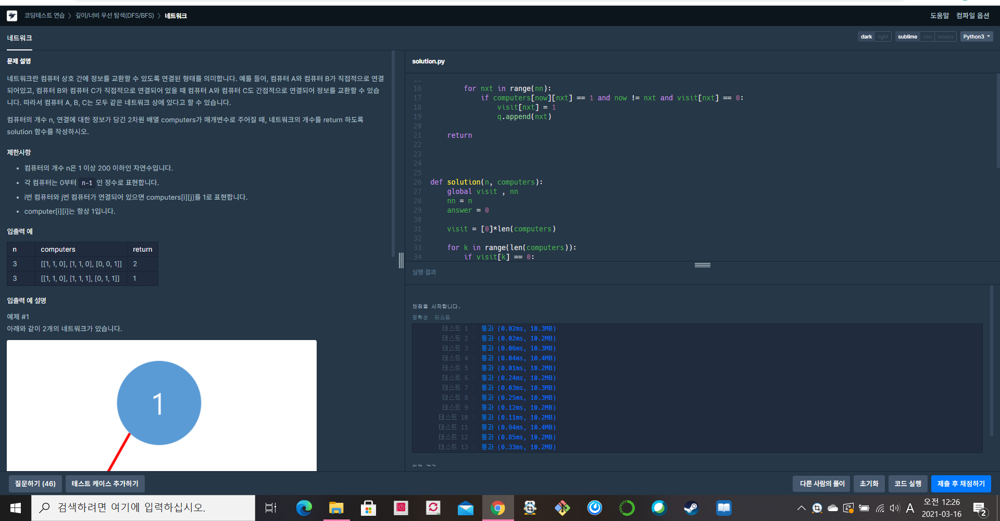

[프로그래머스 : 네트워크] (https://programmers.co.kr/learn/courses/30/lessons/43162)


- 백준에 단련된 나에게 이 문제는 너무 쉬웠다.....
- visit이라는 배열을 만든다
- visit이 0인 경우 bfs를 돌린다.
- bfs를 돌면서 도착한 컴퓨터의 visit을 1로 바꾼다.
- 돌아간  bfs만큼 네트워크의 수가 존재한다.


2021.03.16 (10~15분 컷)


```python
from collections import deque

visit = []
nn = 0

def bfs(start,computers):
    global visit ,nn
    
    q = deque()
    q.append(start)
    visit[start] = 1
    
    while q:
        now = q.popleft()
        
        for nxt in range(nn):
            if computers[now][nxt] == 1 and now != nxt and visit[nxt] == 0:
                visit[nxt] = 1
                q.append(nxt)
                
    return
                
                
    

def solution(n, computers):
    global visit , nn
    nn = n
    answer = 0
    
    visit = [0]*len(computers)
    
    for k in range(len(computers)):
        if visit[k] == 0:
            bfs(k,computers)
            answer += 1
    print(answer)
    return answer
```



