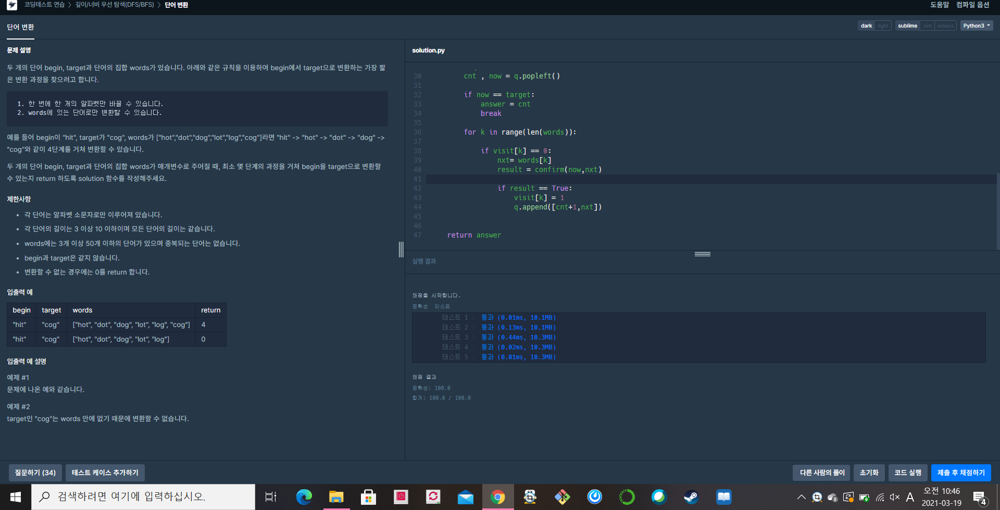

[프로그래머스 : 단어변환] (https://programmers.co.kr/learn/courses/30/lessons/43163)


- 레벨3 치고는 굉장히  쉬웠던 문제 10분정도 걸린듯 하다.
- 로직은 다음과 같다.
  - words와 일치되는 visit리스트를 만든다 -> 한 번 방문한 워드는 다시 방문하지 않기 위해서
  - 그외의 과정은 일반적인 bfs와 같다. 
    - 다만 약간 유의할 점은 confirm함수인데, confirm 함수는 서로다른 글자수가 하나인지 확인하는 함수이다. 애초에 둘의 길이가 같지 않거나 서로 다른 문자수가 하나가 아닐 경우 False를 리턴한다.


```python
from collections import deque

def confirm(a,b):
    
    la = len(a)
    lb = len(b)
    
    if la != lb:
        return False
    else:
        diff = 0
        for k in range(la):
            if diff>1:
                return False
            else:
                if a[k] != b[k]:
                    diff += 1
        if diff == 1:
            return True

def solution(begin, target, words):
    answer = 0
    
    visit = [0]*len(words)
    
    q = deque()
    q.append([0,begin])
    
    while q:
        cnt , now = q.popleft()
        
        if now == target:
            answer = cnt
            break
            
        for k in range(len(words)):
            
            if visit[k] == 0:
                nxt= words[k]
                result = confirm(now,nxt)

                if result == True:
                    visit[k] = 1
                    q.append([cnt+1,nxt])
            
    
    return answer
```

