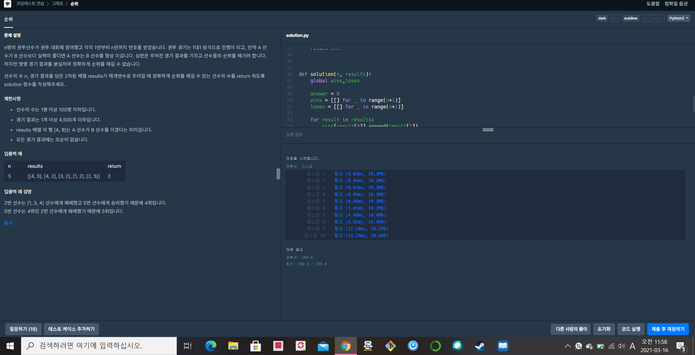

[프로그래머스 : 순위] (https://programmers.co.kr/learn/courses/30/lessons/49191)


- 쉬운 그래프 문제
- 각 선수에 대한 승리 리스트와 패배리스트를 만든다.
- 각 선수의 승리 리스트 순회의 총합 + 패배 리스트 순회의 총합이 n-1과 같으면 (전체인원 - 자신)
- 예제의 경우
-  [[], [2], [5], [2], [3, 2], []] 각 선수의 승리 리스트
- [[], [], [4, 3, 1], [4], [], [2]] 각 선수의 패배리스트가 다음과 같이 나옴
- 1번유저의 승리 리스트를 순회하면 1 -> 2 ->5 (2명) 패배 리스트 순회하면 1-> 없음 총 2명이므로 1의 순위는 알 수 없음

2021.03.16

```python
from collections import deque

wins = []
loses = []

def winning(k,n):
    global wins,loses
    
    q = deque()
    q.append(k)
    ans = 0
    visit = [0]*(n+1)
    
    while q:
        now = q.popleft()
        for nxt in wins[now]:
            if visit[nxt] == 0:
                visit[nxt] = 1
                q.append(nxt)
                ans += 1
                
    return ans

def losing(k,n):
    global wins,loses
    
    q = deque()
    q.append(k)
    ans = 0
    visit = [0]*(n+1)
    
    while q:
        now = q.popleft()
        
        if loses[now] != []:
            for nxt in loses[now]:
                if visit[nxt] == 0:
                    visit[nxt] = 1
                    q.append(nxt)
                    ans += 1
                
    return ans
    


def solution(n, results):
    global wins,loses
    
    answer = 0
    wins = [[] for _ in range(n+1)]
    loses = [[] for _ in range(n+1)]
    
    for result in results:
        wins[result[0]].append(result[1])
        loses[result[1]].append(result[0])
    
    # print(wins)
    # print(loses)
    for k in range(1,n+1):
        w = winning(k,n)
        l = losing(k,n)
        if w +l == n-1:
            answer += 1
            
   
    return answer
```

