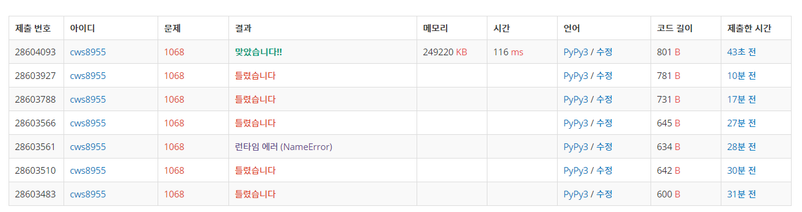

[백준 : 트리] (https://www.acmicpc.net/problem/1068)


- 오타 때문에 고생한 문제.....
- parent node와 대비되는 child 관련 list를 만들면 쉽게 풀 수 있는 문제다.


```python
import sys
sys.stdin = open('1068.txt','r')
sys.setrecursionlimit(10**5)

def dfs(now):
    global n,delete,child,answer,visit


    if len(child[now]) == 0:
        answer += 1

    for nxt in child[now]:
        if nxt != delete:
            if visit[nxt] == 0:
                visit[nxt] = 1
                dfs(nxt)
                visit[nxt] = 0

    return

n = int(input())
parent = list(map(int, input().split()))
delete = int(input())
child = [[] for _ in range(n)]
visit = [0]*n
root = None

for k in range(n):
    if parent[k] != -1:
        child[parent[k]].append(k)
    else:
        root = k

answer = 0
visit[root] = 1
if root == delete:
    child[root] = []
else:
    child[parent[delete]].remove(delete)

# print(child)

if root != delete:
    if n == 2:
        answer = 1
    else:
        dfs(root)

print(answer)
```

