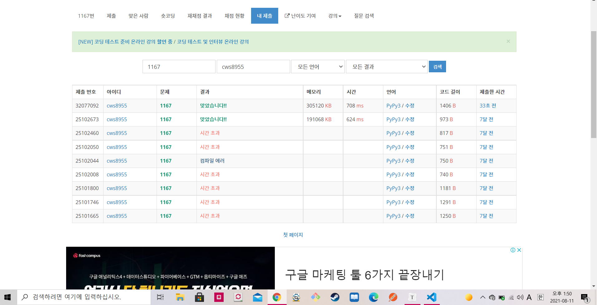

[ 백준 : 트리의 지름 ] (https://www.acmicpc.net/problem/1167)


- dfs 복습을 위해 과거에 푼 문제를 다시 풀었다.
- 시간은 20분 정도 걸린거 같다.
- 트리의 지름이라는 개념에 dfs를 활용하는 문제이다.


```python
import sys
sys.stdin = open('1167.txt','r')
input = sys.stdin.readline
sys.setrecursionlimit(10**5)

def setting_dfs(now,distance):
    global n,roads,setting_point,setting_distance,setting_visit

    if distance > setting_distance:
        setting_point = now
        setting_distance = distance


    for nxt, wt in roads[now].items():
        if setting_visit[nxt] == 0:
            setting_visit[nxt] = 1
            distance += wt
            setting_dfs(nxt,distance)
            distance -= wt
        

    return


def dfs(now,distance):
    global n,roads,distance_,visit

    if distance > distance_:
        distance_ = distance


    for nxt, wt in roads[now].items():
        if visit[nxt] == 0:
            visit[nxt] = 1
            distance += wt
            dfs(nxt,distance)
            distance -= wt
        

    return

n = int(input())
roads = {node:{} for node in range(n+1)}
setting_point = 1
setting_distance = 0
setting_visit = [0]*(n+1)

visit = [0]*(n+1)
distance_ = 0


for _ in range(n):
    arr = list(map(int,input().split()))
    s = arr[0]
    arr = arr[1:-1]
    l = len(arr)
    for a in range(0,l,2):
        n = arr[a]
        e = arr[a+1]
        value = roads.get(s)
        vv = value.get(n)
        if vv == None or vv > e:
            roads[s][n] = e
            roads[n][s] = e

setting_visit[1] = 1
setting_dfs(1,0)

visit[setting_point] = 1
dfs(setting_point,0)

print(distance_)
        


```

