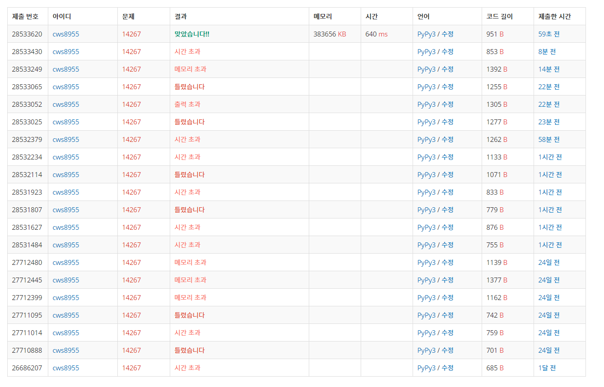

[백준 : 회사 문화 1] (https://www.acmicpc.net/problem/14267)


- 시간 효율성에서 엄청 애먹었던 문제
- 시간초과에서 헤메던 중 문득 중복에 관한 생각을 하게되었다.
- 같은 사람에게 여러번 칭찬을 해줄 경우 칭찬값들을 다 더해서 한 번만 해주면 되지 않을까?
- 그 후에는 일반 dfs를 활용해 풀었다.


```python
import sys
sys.stdin = open('14267.txt','r')
sys.setrecursionlimit(10**5)
from copy import deepcopy

def dfs(who,how,vp):
    global n,m,go_down,answer,visit

    lst = []

    for nxt in go_down[who]:
        if visit[nxt] != vp:
            visit[nxt] = vp
            answer[nxt] += how
            lst.append(nxt)
            dfs(nxt,how,vp)

    # for ls in lst:
    #     visit[ls] = 0
    return


n,m = map(int, input().split())
go_up = [-1] + list(map(int, input().split()))
# go_down = [-1]*(n+1)
go_down = [[] for _ in range(n+1)]
visit = [0]*(n+1)
answer = [0]*(n+1)
for k in range(1,n+1):
    down = go_up[k]
    if down != -1:
        go_down[down].append(k)

clap = [0]*(n+1)

for k in range(m):
    who , how = map(int, input().split())
    clap[who] += how

for k in range(2,n+1):
    if clap[k] != 0:

        answer[k] += clap[k]
        visit[k] = k+1
        dfs(k,clap[k],k+1)
    # visit[who] = 0

answer = answer[1:]

for ans in answer:
    print(ans, end= ' ')
```


