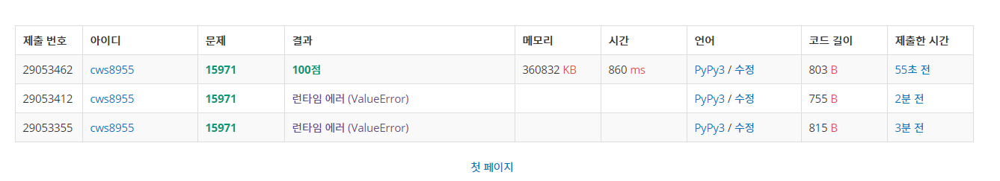

[백준 : 두 로봇] (https://www.acmicpc.net/problem/15971)


- 쉬운 dfs문제
- 시작점에서 도착점까지의 간선거리 총합 - 간선들중 가장 컸던 값 빼주면 됨
- 노드가 하나인 경우도 있으므로 주의하자


```python
import sys
sys.stdin = open('15971.txt','r')
sys.setrecursionlimit(10**5)
from copy import deepcopy

def dfs(now,move):
    global total , arr, visit , n , s ,e , lst ,ans_lst

    if now == e:
        total = move
        ans_lst = deepcopy(lst)
        return

    for nxt , wt in arr[now]:
        if visit[nxt] == 0:
            visit[nxt] = 1
            move += wt
            lst.append(wt)
            dfs(nxt,move)
            move -= wt
            visit[nxt] = 0
            lst.pop()

    return 


n,s,e = map(int, input().split())
arr = [[] for _ in range(n+1)]
visit = [0]*(n+1)

for _ in range(n-1):
    a,b,w = map(int, input().split())
    arr[a].append([b,w])
    arr[b].append([a,w])

total = 0
lst = []
ans_lst = []

visit[s] = 1
dfs(s,0)

if len(ans_lst) > 0:
    print(total - max(ans_lst))
else:
    print(total)
```

