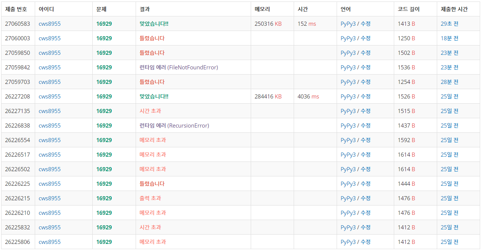

[백준 -  Two dots] (https://www.acmicpc.net/problem/16929)


### dfs문제지만 생각할 거리가 은근히 많다.

- 시간 효율성을 위해 이미 지나간 dot은 새롭게 함수에 넣어주지 않는 다는점
- 현재 위치 y,x와 다음 위치 ny,nx 그리고 이전 위치 py,px  세가지를 활용해야한다.
  - ny,nx가 py,px와 같을 경우 성공 조건이 아니지만 if문을 잘못짜면 성공으로 코드가 작동할 수 있다. 그렇기 때문에 새롭게 dfs에 이동할때 ny==py and nx==px 인 조건은 넣지 않는다.
- 한번이라도 사이클이 생기는 경우 모든 반복문을 종료하고 "Yes"를 출력한다.
- visit배열은 이미 확인한 지점이 dfs 함수에 처음 시작하는걸 방지하기 위한 배열이며 check배열은 함수 하나의 실행과정 안에서의 중복을 방지하기 위하 배열이다.


2021.03.07에 문제를 풀었으며 git 업로드는 3월 8일!!!! 


```python
import sys
sys.stdin = open('16929.txt','r')
sys.setrecursionlimit(10**5)

def dfs(y,x,py,px,color,move):
    global n,m,arr,visit,ans,check

    # print(y,x,py,px,color,move)

    if check[y][x] == 1 and move >3 and arr[y][x] == color :
        ans = True
        # print(ans)
        return

    check[y][x] = 1

    for k in range(4):
        ny = y+dy[k]
        nx = x+dx[k]
        if 0<=ny<n and 0<=nx<m:
            if arr[ny][nx] == color:
                if not (ny == py and nx == px):
                    # check[ny][nx] = 1
                    visit[ny][nx] = 1
                    move += 1
                    dfs(ny,nx,y,x,color,move)
                    move -= 1
                    # check[ny][nx] = 0

    return

        

dy = [0,0,-1,1]
dx = [1,-1,0,0]

n,m = map(int, input().split())
arr = []
for _ in range(n):
    arr1 = list(input())
    arr.append(arr1)

visit = [[0]*m for _ in range(n)]
check = [[0]*m for _ in range(n)]
ans = False
answer = False
stop = False
for y in range(n):
    for x in range(m):
        if visit[y][x] == 0:
            visit[y][x] = 1
            check[y][x] = 1
            dfs(y,x,y,x,arr[y][x],0)
            check = [[0]*m for _ in range(n)]
            # print('--------------',ans)
            if ans == True:
                answer = True
                stop = True
                break
    if stop == True:
        break

if answer == False:
    print('No')
else:
    print('Yes')

```





### 과거에 풀었을때보다 효율성이 매우 좋다.

