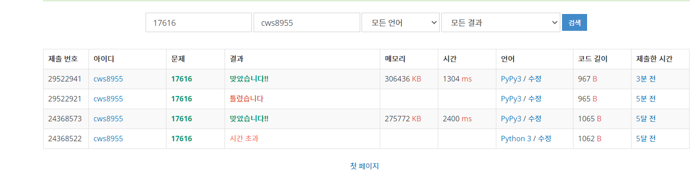

[백준 : 등수 찾기] (https://www.acmicpc.net/problem/17616)


- 예전에 풀었던 dfs문항을 다시 풀어보았다.
- up배열과 down배열을 만든다.
- 각각의 배열은 자신보다 앞에있는 사람과 뒤에있는 사람의 수를 알아내기 위한 작업에 활용된다.
- 예를들어 5명이 주어지고 내 앞에 2명 내 뒤에 1명이 나오면 앞에서는 3 뒤에서는 4를 출력하면 된다.


2021.05.24 am 8:00경

86


```python
import sys
sys.stdin = open('17616.txt','r')
sys.setrecursionlimit(10**5)

def go_up(now):
    global n,m,up,down,visit_up,up_ans

    # print('up',now)

    for nxt in up[now]:
        if visit_up[nxt] == 0:
            visit_up[nxt] = 1
            up_ans += 1
            go_up(nxt)

    return

def go_down(now):
    global n,m,up,down,visit_down,down_ans

    # print('down',now)
    for nxt in down[now]:
        if visit_down[nxt] == 0:
            visit_down[nxt] = 1
            down_ans += 1
            go_down(nxt)

    return


n,m,p = map(int, input().split())

up = [[] for _ in range(n+1)]
down = [[] for _ in range(n+1)]
visit_up = [0]*(n+1)
visit_down = [0]*(n+1)

up_ans = 0
down_ans = 0

for _ in range(m):
    a,b = map(int, input().split())
    up[b].append(a)
    down[a].append(b)


# print(up)
# print(down)
# visit_up[p] = 1
# visit_down[p] = 1
go_up(p)
go_down(p)

print(up_ans)
print(down_ans)

# print('----------------')
print(down_ans, end =' ')
print(n-up_ans)


```

