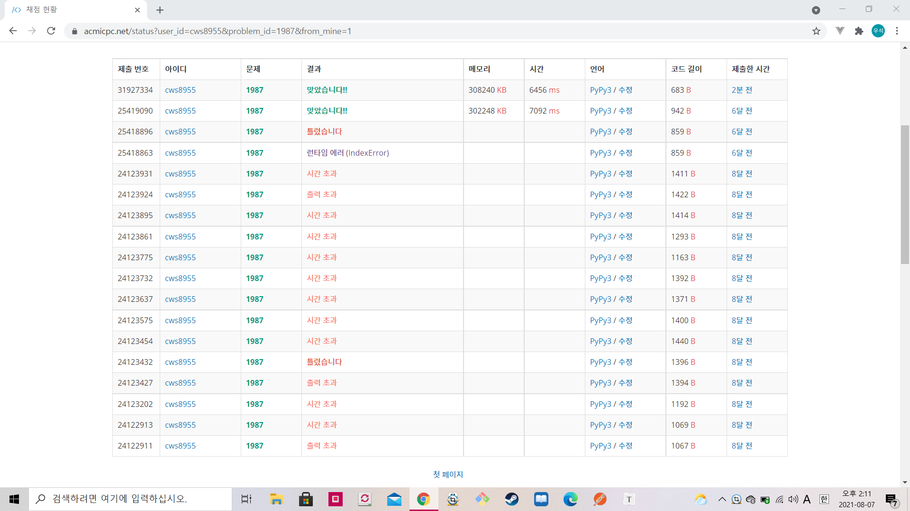

[ 백준 : 알파벳 ] (https://www.acmicpc.net/problem/1987)


- 2021-08-07에 푼 문항

- 오늘 문제가 너무 안풀려서 과거에 풀었던 문제를 다시 풀어보았다.
- 10분정도 걸린거 같다....
- 리프레쉬 했드아아아아!!!1


```python
import sys
sys.stdin = open('1987.txt','r')
sys.setrecursionlimit(10**5)

def dfs(y,x,cnt):
    global n,m,visit,answer,arr

    if cnt > answer:
        answer = cnt

    for k in range(4):
        ny = y+dy[k]
        nx = x+dx[k]
        if 0<=ny<n and 0<=nx<m:
            if visit[ord(arr[ny][nx])-65] == 0:
                visit[ord(arr[ny][nx])-65] = 1
                cnt += 1
                dfs(ny,nx,cnt)
                cnt -= 1
                visit[ord(arr[ny][nx])-65] = 0

    return

n,m = map(int,input().split())
dy = [0,0,1,-1]
dx = [1,-1,0,0]
visit = [0]*26
answer = 0
arr = []
for _ in range(n):
    ar = list(input())
    arr.append(ar)

visit[ord(arr[0][0])-65] = 1
dfs(0,0,1)


print(answer)

```

