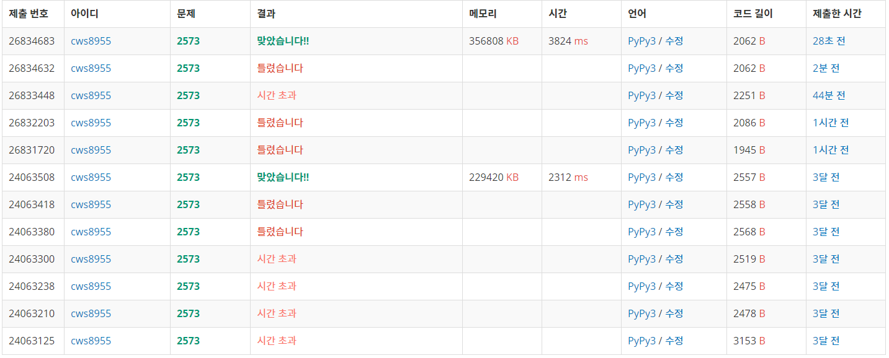

[빙산 2573] (https://www.acmicpc.net/problem/2573)


###### 과거에 풀었던 문제를 다시 한 번 풀어 보았다.

###### bfs와 dfs가 동시에 활용되는 문제이다

###### 과거의 나보다 현재의 내가 작성한 코드가 더 느리다..... 과거의 나여 어떤 싸움을 한건가요...


```python
import sys
sys.stdin = open('2573.txt','r')
sys.setrecursionlimit(10**5)
from copy import deepcopy
from collections import deque

def melting(ic):
    global n,m,arr,ice,ice_nm,temp,visit,lst

    cntt = 0
    for k in range(4):
        ny = ic[1]+dy[k]
        nx = ic[2]+dx[k]
        if 0<=ny<n and 0<=nx<m:
            if arr[ny][nx] == 0:
                cntt += 1

    temp[ic[1]][ic[2]] = arr[ic[1]][ic[2]] - cntt

    if temp[ic[1]][ic[2]] <= 0:
        temp[ic[1]][ic[2]] = 0
        lst.append(ic)

    return


def confirm(ic):
    global n,m,arr,ice,ice_nm,temp,visit,lst

    q = deque()
    q.append([ic[1],ic[2]])
    visit[ic[1]][ic[2]] = 1

    ct = 1

    while q:
        y,x = q.popleft()

        for k in range(4):
            ny = y+dy[k]
            nx = x+dx[k]
            if 0<=ny<n and 0<=nx<m:
                if visit[ny][nx] ==0 and arr[ny][nx] > 0:
                    visit[ny][nx] = 1
                    ct += 1
                    q.append([ny,nx])

    return ct


dy = [0,0,-1,1]
dx = [1,-1,0,0]
n,m = map(int, input().split())
arr = []
for _ in range(n):
    arr1 = list(map(int, input().split()))
    arr.append(arr1)

ice = []
ice_nm = 0
for y in range(n):
    for x in range(m):
        if arr[y][x] != 0:
            ice.append([ice_nm,y,x])
            ice_nm += 1

temp = deepcopy(arr)
lst = []

visit = [[0]*m for _ in range(n)]

# print(ice)
cnt = 1
ll = len(ice)
while True:
    # print(cnt)
    for ic in range(ll):
        melting(ice[ic]) # 얼음 하나씩 녹이기

    if len(ice) == 0: # 갑자기 ice의 길이가 0이되는 경우 한번에 녹아서 갑자기 전체 얼음이 사라짐을 의미
        cnt = 0
        break

    for ls in lst:
        ice.remove(ls) # 녹아서 0이된 얼음 없애주기
        ice_nm -= 1 # 전체 얼음의 개수 -1

    lst = []
    arr = deepcopy(temp)

    for ic in ice:
        length = confirm(ic) # 한 덩어리의 얼음 크기 출력, 무조건 한 덩어리의 얼음이 전체 얼음의 크기와 같아야 함 다르다면 두덩어리 이상으로 나누어짐을 의미
        break

    if length < ice_nm: # 전체 얼음의 개수보다 덩어리 얼음이 작을 경우 두개로 나누어짐을 의미
        break


    visit = [[0]*m for _ in range(n)]
    cnt += 1
    ll = len(ice)

print(cnt)
```





###### 3개월 전에 내가 맞춘 코드보다 효율성이나 시간이 별로다....... 그때의 나여..... 어떤싸움을

