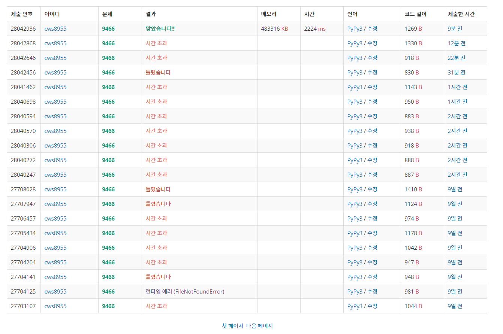

[백준 : 텀 프로젝트] (https://www.acmicpc.net/problem/9466)


##### 2021.04.05


- 시간초과 때문에 멘탈이 터졌던 문제......
- 로직 
  - 문제를 읽자마자 싸이클 관련 문제라는 점을 깨달았다.
  - 먼저 자료구조를 설명하자면
    - visit : dfs 함수 같은 곳을 또 가는 것을 방지하는 배열
    - answer : 팀이 이루어진 친구들을 확인하는 배열
    - fail : 싸이클이 실패한 친구들을 넣어주는 배열
    - 싸이클에 성공하든 실패하든 한 번 확인되면 다시 돌릴 필요 없음
  - dfs함수를 통해 순차적으로 확인한다.
    - dfs2 함수를 통해 싸이클이 확인된 경우 싸이클이 된 애들은 answer 배열에 넣어준다.
    - 만약에 1 -> 5 -> 3 -> 4 ->2 ->3 이런 순서가 존재한다면
    - 3,4,2,3은 싸이클이기 때문에 dfs2 함수에서 answer를 갱신해주고
    - 1과 5는 싸이클이 아니기 때문에 fail에 넣어준다


```python
import sys
sys.stdin = open('9466.txt','r')
sys.setrecursionlimit(123456)
input = sys.stdin.readline

def dfs2(now,start):
    global n,choices,visit,temps,answer,flag,flags


    if now == start:
        answer[now] = start
        return

    if answer[now] == 0:
        answer[now] = start
        dfs2(choices[now],start)

    return

def dfs(now,start):
    global n,choices,visit,temps,answer,flag


    if visit[choices[now]] != 0:
        dfs2(choices[now],now)
        flag = True
        return

    choose = choices[now]

    if visit[choose] == 0 and answer[choose] == 0 and fail[choose] == 0:
        visit[choose] = 1

        dfs(choose,start)
        if flag == False:
            fail[now] = 1
        visit[choose] = 0

    return

t = int(input())
for tc in range(t):
    n = int(input())
    choices = list(map(int, input().split()))
    choices.insert(0,0)

    visit = [0]*(n+1)
    answer = [0]*(n+1)
    fail = [0]*(n+1)

    temps = []

    for k in range(1,n+1):
        if answer[k] == 0 and fail[k] == 0:
            flag = False
            dfs(k,k)
            if flag == False:
                answer[k] = 0
                fail[k] = 1


    answer = answer[1:]

    print(answer.count(0))
```


