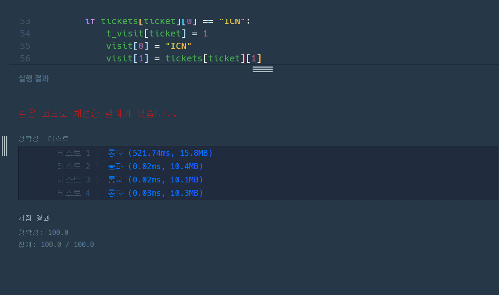

[프로그래머스 : 여행경로] (https://programmers.co.kr/learn/courses/30/lessons/43164)


- 프로그래머스 문제들을 요즘 조금씩 풀어보고 있는중이다.
- 로직은 간단하다
- dfs를 활용해서 티켓을 다쓰면서 이동하는 모든 경로를 계산해준 후 이 중 알파벳이 순 정렬이 가장 빠른 데이터를 출력해준다.


```python
from copy import deepcopy

visit = []
answer_lst = []
end = 0
airports = set()
air = []
t_visit = []

def dfs(city,cnt,tickets):
    global visit , answer_lst , end ,airports, t_visit

    if cnt == end:
        temp = deepcopy(visit)
        answer_lst.append(temp)
        # print('-----adfadfadfa')
        return
    
    for t in range(end):
        # print(t_visit,t,tickets[t][0],t_visit[t],city,cnt)
        if tickets[t][0] == city and t_visit[t] == 0:
            # print('--------')
            t_visit[t] = 1
            cnt += 1
            visit[cnt] = tickets[t][1]
            dfs(tickets[t][1],cnt,tickets)
            t_visit[t] = 0
            visit[cnt] = 0
            cnt -= 1
            
    return
    
        
    
def solution(tickets):
    global visit , answer_lst , end , airports,t_visit

    end = len(tickets)
    visit = [0]*(end+1)
    t_visit = [0]*end
    
    for ticket in tickets:
        airports.add(ticket[0])
        airports.add(ticket[1])
    
    
    temp = sorted(airports, key=lambda x : (x[0], x[1] , x[2]))    
    for te in temp:
        air.append(te)
    
    for ticket in range(end):
        # print(tickets[ticket][0])
        if tickets[ticket][0] == "ICN":
            t_visit[ticket] = 1
            visit[0] = "ICN"
            visit[1] = tickets[ticket][1]
            dfs(tickets[ticket][1],1,tickets)
            t_visit = [0]*end
            
    
    # print(answer_lst)
    answer = []
    for ans in answer_lst:
        if ans[0] == 'ICN':
            answer.append(ans)
    # print(answer)
    temp = sorted(answer, key=lambda x : x)
    # print(temp)
        
    return temp[0]
```




첫번째 테스트케이스가 양이 많아서 그런건가? 아니면 내 코드의 효율성이 특정부분에서 구멍이 난건가......?  나중에 다시 풀어봐야겠다.