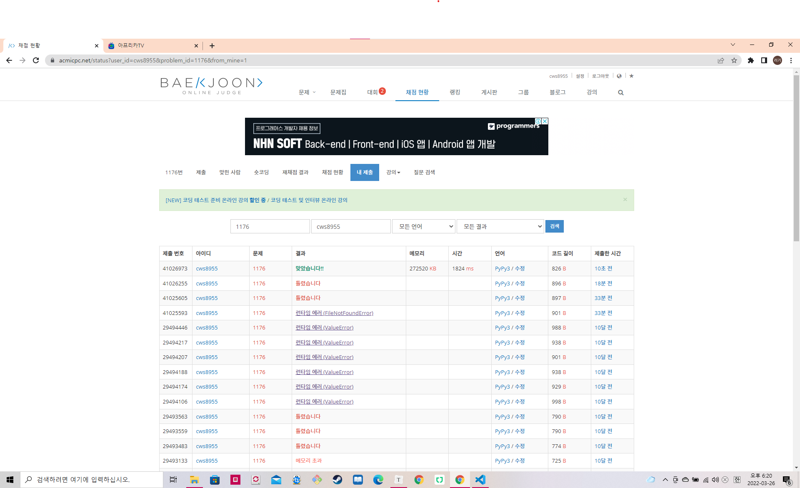

백준 (https://www.acmicpc.net/status?user_id=cws8955&problem_id=1176&from_mine=1)


- dp + 비트마스킹의 기본 문제
- 골드1 난이도 이지만, 이제 이런 문제는 많이 풀어서 할 만하다,
- 나는 top-down 방식 (재귀를 활용한 방식을 활용해서 주로 품)
- 예전에는 top-down 방식이 어떻게 중복을 해결하는지에 대해서 , 코드는 짜지만 이해를 잘 하지 못했다. 물론 지금 완벽하게 이해하는건 아니지만 어느정도 재귀를 통해서 모든 경우를 체크하고, 중복을 방지하는 과정이 예전보다 많이 이해된 것 같다.


```python
import sys
sys.setrecursionlimit(10**5)
sys.stdin = open('1176.txt','r')

def makeDp(nowNode, visit):

    if visit == endPoint:
        return 1

    if dp[nowNode][visit] != 0:
        return dp[nowNode][visit]


    for nxtNode in range(1,n+1):
        if not visit & (1<<nxtNode):
            if nowNode == 0:
                dp[nowNode][visit] += makeDp(nxtNode, visit|(1<<nxtNode))
            else:
                if abs(heights[nowNode] - heights[nxtNode]) > k:
                    dp[nowNode][visit] += makeDp(nxtNode, visit|(1<<nxtNode))


    return dp[nowNode][visit]

n,k = map(int, input().split())
heights = []
heights.append(float('inf'))

for _ in range(n):
    tall = int(input())
    heights.append(tall)

dp = [[0] * (1<<n+1) for _ in range(n+1)]

endPoint = 0
for nxt in range(1,n+1):
    endPoint |= 1<<nxt

makeDp(0,0)

print(dp[0][0])
```



