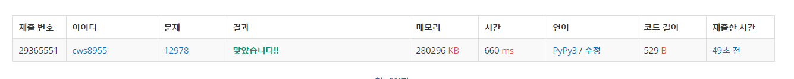

[백준 : 스크루지 민호2] (https://www.acmicpc.net/problem/12978)


- 트리 dp의 기본 문제
- 2533번 사회망 서비스 문제와 매우 유사하다 
- 사회망서비스 문제는 기본 코드를 인터넷을 보고 공부해서 푸쉬는 하지 않았다.
- 스크루지 민호2는 사회망 서비스와 너무 비슷한 문제이다. 공부한 내용을 복기하며 풀었다


```python
import sys
sys.stdin = open('12978.txt','r')
sys.setrecursionlimit(10**5)

def solve(num):
    visit[num] = 1
    dp[num][0] = 0
    dp[num][1] = 1

    for i in edges[num]:
        if visit[i] == 0:
            solve(i)
            dp[num][0] += dp[i][1]
            dp[num][1] += min(dp[i][0],dp[i][1])

    return

n = int(input())
edges = [[] for _ in range(n+1)]
for _ in range(n-1):
    a,b = map(int, input().split())
    edges[a].append(b)
    edges[b].append(a)

visit = [0]*(n+1)

dp = [[0,0] for _ in range(n+1)]

solve(1)
print(min(dp[1][0],dp[1][1]))
```

