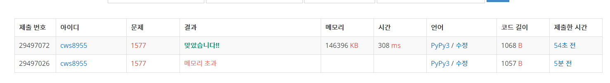

[백준 : 도로의 개수] (https://www.acmicpc.net/problem/1577)


- dp문제
- 최단거리로만 움직인다는 것을 잊고 있는 바람에 시간이 조금 더 걸렸다.
- 나중에 확인하고 아차 싶었다.


```python
import sys
sys.stdin = open('1577.txt','r')
sys.setrecursionlimit(10**5)
from copy import deepcopy

def go(y,x):
    global n,m,k,dp,arr


    if y == n and x == m:
        dp[y][x] = 1
        return 1

    if dp[y][x] != 0:
        return dp[y][x]

    # print(y,x)
    # tmp = dp[y][x]
    for k in range(2):
        ny = y+dy[k]
        nx = x+dx[k]
        # print('----',ny,nx)
        if 0<=ny<=n and 0<=nx<=m:
            if (y,x,ny,nx) not in arr:
                # print('}}}}}}}}}}}}}}}}}}',ny,nx)
                # print('-----',[y,x,ny,nx])
                # print(ny,nx)
                dp[y][x] += go(ny,nx)
                # print('------')
                # tmp += dp[ny][nx]
                # print(tmp)

                

    # dp[y][x] = tmp
    return dp[y][x]

dy = [1,0]
dx = [0,1]
m,n = map(int, input().split())
k = int(input())
dp = [[0]*(m+1) for _ in range(n+1)]

arr = set()


for _ in range(k):
    a,b,c,d = list(map(int, input().split()))
    arr1 = [b,a,d,c]
    arr2 = [d,c,b,a]
    arr.add(tuple(arr1))
    arr.add(tuple(arr2))


# print(arr)
go(0,0)
print(dp[0][0])
```

