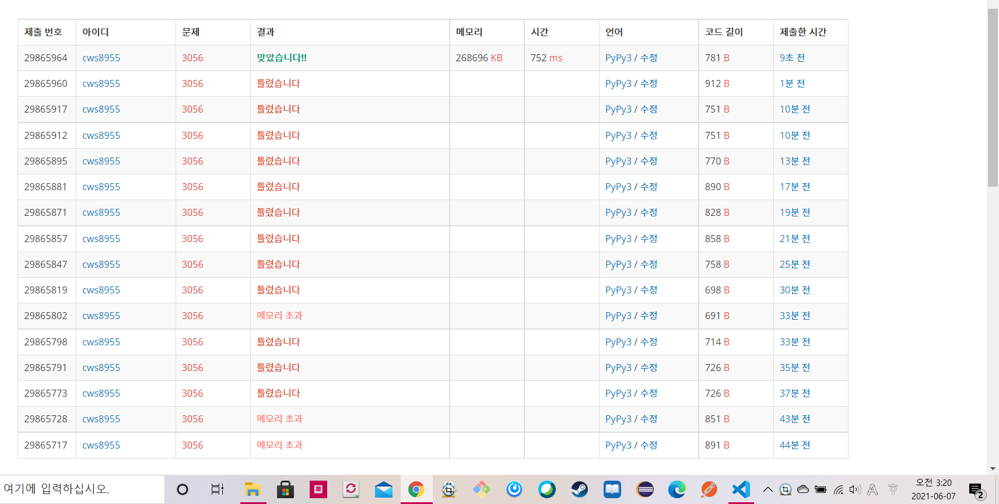

[백준 : 007] (https://www.acmicpc.net/problem/3056)


- 아무리 봐도 맞는데 계속 틀렸습니다가 나왔던 문제......
- 오타때문이였다
- 일반적인 tsp문제와 같다.
- 다만 헷갈렸던 점은 dp의 구조인데, 해당 문제는 1차원으로 dp를짜도 돌아간다.
- 순서가 중요하지 않고 그냥 미션을 클리어만 하면 되기 때문이다.


```python
import sys
sys.setrecursionlimit(10**5)

def go(depth,visit,de,co):
    global n,arr,dp,answer

    if depth == n:
        return 1
        
    if dp[visit] != -1:
        return dp[visit]

    for i in range(n):
        if not visit&(1<<i):
            de += 1
            co -= 1
            visited = visit|(1<<i)
            dp[visit] = max(dp[visit], go(depth+1,visited,de,co)*(arr[depth][i]/100))
            de -= 1
            co += 1
    
    return dp[visit]

n = int(input())
arr = []
for _ in range(n):
    arr1 = list(map(int,input().split()))
    arr.append(arr1)

dp = [-1]*(1<<n)

print("{:.6f}".format(go(0,0,1,n)*100))
    arr1 = list(map(int,input().split()))
    arr.append(arr1)

dp = [-1]*(1<<n)
visited = [0]*n

answer = 0


print("{:.6f}".format(go(0,0,1,n)*100))
# a = answer/(100**(n-1))
# print(dp)

# print("{:.6f}".format(answer*100))
# print(answer)
# print(answer/100**(n-1))
# print(dp)
```

