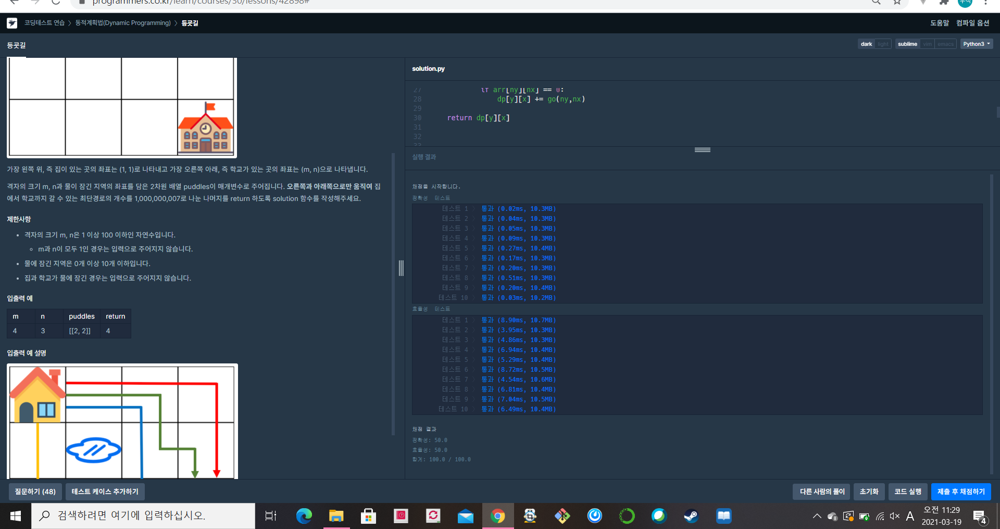

[프로그래머스 : 등굣길] (https://programmers.co.kr/learn/courses/30/lessons/42898)

- 레벨3

- 단순한 dp문제 
- 백준에서 이런 유형을 굉장히 많이 풀어보았다.
- 알고리즘은 top-down방식을 활용하였다 (사실 bottom-up은 잘 하지 못한다.)
  - 2021.03.19 두번째 문제

```python
import sys  
sys.setrecursionlimit(10**9)


arr = []
dp = []
dy = [0,-1]
dx = [-1,0]
nn = 0
mm = 0

def go(y,x):
    global arr , dp ,nn ,mm ,dy ,dx
    
    
    if y == 0 and x == 0:
        dp[y][x] = 1
        return dp[y][x]
    
    if dp[y][x] != 0:
        return dp[y][x]
    
    for k in range(2):
        ny = y+dy[k]
        nx = x+dx[k]
        if 0<=ny<nn and 0<=nx<mm:
            if arr[ny][nx] == 0:
                dp[y][x] += go(ny,nx)
            
    return dp[y][x]
    
    
    


def solution(m, n, puddles):
    global arr , dp , nn ,mm
    answer = 0
    
    nn = n
    mm = m
    
    arr = [[0]*m for _ in range(n)]
    
    for puddle in puddles:
        arr[puddle[1]-1][puddle[0]-1] = 1
    
    dp = [[0]*m for _ in range(n)]
    
    go(n-1,m-1)
    
    # for d in dp:
    #     for s in d:
    #         print(s, end = ' ')
    #     print()
    
    
    
    return dp[n-1][m-1]%1000000007
```

