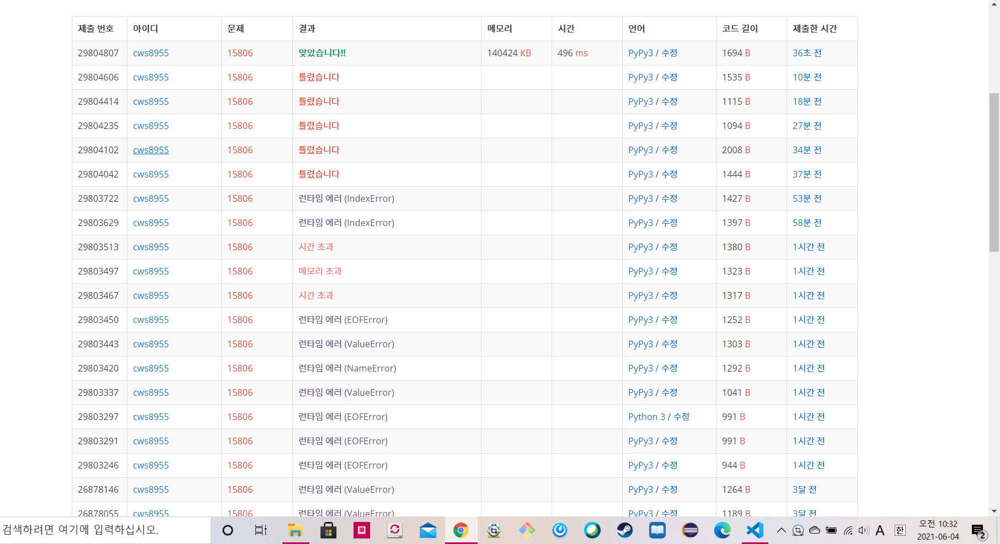

[백준 : 영우의 기숙사 청소] (https://www.acmicpc.net/problem/15806)


- 문제 데이터가 잘못된 것 같아서 예외처리로 입력을 해주었다. - 런타임에러 해결
- 일반적인 bfs로 탐색했으나 시간초과가 발생했다.
- 그런데 생각을 잘 해보니 만약 (y,x)라는 지점에 도착했다면 2의 배수 만큼 이동할때 마다 에는 다시 (y,x)지점에 바이러스가 다시 생긴다는 점을 발견하여 시간초과를 해결하였다.
  - 즉 1일에 해당지점에 바이러스가 있을경우 3,5,7,9,11,13 일에도 바이러스가 생긴다.
  - 홀수인 날 1 , 짝수인 날0 , 홀수이든 짝수이든 무조건 바이러스 있는 경우 2를 넣어주었고
  - 결과적으로 검사하는 날짜 %2을 t라고 했을때 검사하는 위치의 t와 visit에 저장한 값이 같거나 visit에 저장한 값이 2라면 "YES"를 출력해준다.
  - 아닐 경우 "NO"를 출력해준다


```python
import sys
sys.stdin = open('10806.txt','r')
from collections import deque
from copy import deepcopy

n,m,k,t = map(int, input().split())

dy = [-2,-2,-1,-1,1,1,2,2]
dx = [-1,1,-2,2,-2,2,-1,1]

arr = [[0]*n for _ in range(n)]
visit = [[-1]*n for _ in range(n)]
virus = deque()
confirm = deque()

cnt = 0
while cnt < m+k:
    try:
        if cnt < m:
            x,y = map(int, input().split())
            virus.append((y-1,x-1))
            visit[y-1][x-1] = 0
            arr[y-1][x-1] = 1
        if cnt >= m:
            x,y = map(int, input().split())
            confirm.append((y-1,x-1))
        cnt += 1
    except:
        break

day = 1
vl = len(virus)
while day <= t and vl > 0:
    for _ in range(vl):
        y,x = virus.popleft()
        for k in range(8):
            ny = y+dy[k]
            nx = x+dx[k]
            if 0<=ny<n and 0<=nx<n:
                if visit[ny][nx] != 2:
                    if visit[ny][nx] == 0:
                        if day%2 == 1:
                            visit[ny][nx] = 2
                            arr[ny][nx] += 1
                            virus.append((ny,nx))
                    if visit[ny][nx] == 1:
                        if day%2 == 0:
                            visit[ny][nx] = 2
                            arr[ny][nx] += 1
                            virus.append((ny,nx))
                    if visit[ny][nx] == -1:
                        visit[ny][nx] = day%2
                        arr[ny][nx] += 1
                        virus.append((ny,nx))
    day += 1
    vl = len(virus)

tt = (t)%2
# print(visit)
flag = False
for c in confirm:
    y,x = c[0],c[1]
    if visit[y][x] == tt or visit[y][x] == 2:
        print("YES")
        flag = True
        break

if flag == False:
    print("NO")
```

