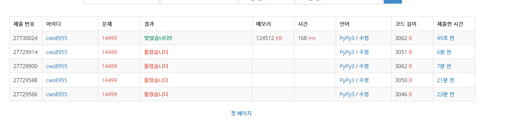

[백준 : 주사위굴리기] (https://www.acmicpc.net/problem/14499)


- 삼성 기출 문제
- 생각보다 쉽게 풀림
- 중간에 3을 2로 적는 오타때문에 10분 넘게 멘붕을 하기도 함
- 로직
  - original_dice를 만든다
  - 각 네 방향의 회전에 따라 dice의 위치가 변하기 때문에 각 회전에 따라 dice의 움직임이 어떻게 변하는지에 대한 네 가지 함수를 만든다.
  - 이동 후 격자안에 있는 지 확인한다.
  - color 함수를 만들어서 숫자에 관련된 작업을 한다.
  - 출력한다


```python
import sys
sys.stdin = open('14499.txt','r')
from copy import deepcopy

def turning_south():
    global n,m,sy,sx,o,arr,orders,original_dice,new_dice

    new_dice[1] = original_dice[5]
    new_dice[2] = original_dice[1]
    new_dice[3] = original_dice[3]
    new_dice[4] = original_dice[4]
    new_dice[5] = original_dice[6]
    new_dice[6] = original_dice[2]

    original_dice = deepcopy(new_dice)
    return

def turning_north():
    global n,m,sy,sx,o,arr,orders,original_dice,new_dice

    new_dice[1] = original_dice[2]
    new_dice[2] = original_dice[6]
    new_dice[3] = original_dice[3]
    new_dice[4] = original_dice[4]
    new_dice[5] = original_dice[1]
    new_dice[6] = original_dice[5]

    original_dice = deepcopy(new_dice)
    return

def turning_west():
    global n,m,sy,sx,o,arr,orders,original_dice,new_dice

    new_dice[1] = original_dice[4]
    new_dice[2] = original_dice[2]
    new_dice[3] = original_dice[1]
    new_dice[4] = original_dice[6]
    new_dice[5] = original_dice[5]
    new_dice[6] = original_dice[3]

    original_dice = deepcopy(new_dice)
    return

def turning_east():
    global n,m,sy,sx,o,arr,orders,original_dice,new_dice

    new_dice[1] = original_dice[3]
    new_dice[2] = original_dice[2]
    new_dice[3] = original_dice[6]
    new_dice[4] = original_dice[1]
    new_dice[5] = original_dice[5]
    new_dice[6] = original_dice[4]

    original_dice = deepcopy(new_dice)
    return

def color():
    global n,m,sy,sx,o,arr,orders,original_dice,new_dice

    if arr[sy][sx] == 0:
        arr[sy][sx] = original_dice[1]
    else:
        original_dice[1] = arr[sy][sx]
        arr[sy][sx] = 0

    return


n,m,sy,sx,o = map(int, input().split())
arr = []
for _ in range(n):
    arr1 =list(map(int, input().split()))
    arr.append(arr1)

orders = list(map(int, input().split()))

original_dice = [0,0,0,0,0,0,0]
new_dice = [0,0,0,0,0,0,0]

cnt = 0
ll = len(orders)

# 1,2,3,4 => 동,서,북,남
# 주사위 굴려서 방향바꾸기
# 숫자 입히기
# 출력하기

cnt = 0
while cnt<ll:
    turn = orders[cnt]
    # print('---',cnt,turn)

    if turn == 4:
        ny = sy+1
        nx = sx
        if 0<=ny<n and 0<=nx<m:
            sy = ny
            sx = nx
            turning_south()
            new_dice = [0,0,0,0,0,0,0]
            color()
            print(original_dice[6])
    if turn == 3:
        ny = sy-1
        nx = sx
        if 0<=ny<n and 0<=nx<m:
            sy = ny
            sx = nx
            turning_north()
            new_dice = [0,0,0,0,0,0,0]
            color()
            print(original_dice[6])
    if turn == 2:
        ny = sy
        nx = sx-1
        if 0<=ny<n and 0<=nx<m:
            sy = ny
            sx = nx
            turning_west()
            new_dice = [0,0,0,0,0,0,0]
            color()
            print(original_dice[6])
    if turn == 1:
        ny = sy
        nx = sx+1
        if 0<=ny<n and 0<=nx<m:
            sy = ny
            sx = nx
            turning_east()
            new_dice = [0,0,0,0,0,0,0]
            color()
            print(original_dice[6])

    cnt += 1


```

