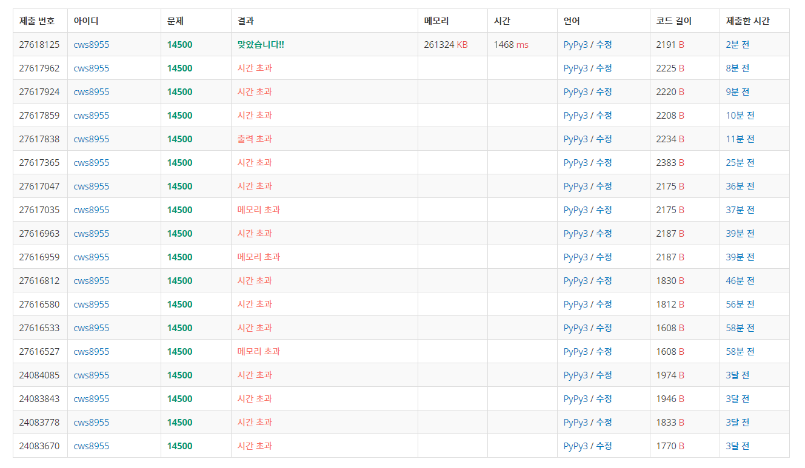

[백준 : 테트로미노] (https://www.acmicpc.net/problem/14500)


-  시간초과 때문에 정말 미쳐버리는 줄 알았던 문제

- 근데 정말 사소한 곳에서 시간초과가 발생했다.......

- 어디서 시간초과인지를 몰라서 질문검색에 있는 글들을 다 봤는데 나의 시간초과와는 모두 관련없는 글들 뿐이였다. 그래서 그냥 중간에 visit배열을 수정해주었는데 바로 해결되었다.........

- 각 dfs를 돌때마다 그냥 visit 방문 배열을 새롭게 초기화 해줬는데 이 과정에서 시간이 엄청들었다.

- ```python
  visit = [[0]*m for _ in range(n)]를 visit[y][x] = 0으로 바꾸었더니 해결되었다......
  ```

- 로직

  - 로직은 단순하다.
  - ㅗ 모양을 제외한 경우는 dfs로 탐색해주었고, ㅗ의 경우에는 초기에 세팅된 값으로 1회만 bfs해주었다.

```python
import sys
sys.stdin = open('14500.txt','r')
sys.setrecursionlimit(10**5)
from collections import deque

def dfs(y,x,many,cnt):
    global n,m,arr,answer,visit

    if many == 4:
        if answer < cnt:
            answer = cnt
        return

    for k in range(4):
        ny = y+dy[k]
        nx = x+dx[k]
        if 0<=ny<n and 0<=nx<m:
            if visit[ny][nx] == 0:
                visit[ny][nx] = 1
                many += 1
                cnt += arr[ny][nx]
                dfs(ny,nx,many,cnt)
                visit[ny][nx] = 0
                many -= 1
                cnt -= arr[ny][nx]

    return

def bfs(y,x,cnt,b):
    global dy,dx,n,m,arr,answer

    q = deque()
    q.append([y,x])
    ans = cnt

    ct = 0
    while ct < 1:
        y,x = q.popleft()

        stop = 0
        for k in b:
            ny = y+dy[k]
            nx = x+dx[k]
            if 0<=ny<n and 0<=nx<m:
                stop += 1
                ans += arr[ny][nx]


        if stop == 3:
            if ans > answer:
                answer = ans

        
        ct += 1

    return


    
dy = [-1,1,0,0]
dx = [0,0,-1,1]

n,m = map(int, input().split())

arr= []
for _ in range(n):
    arr1 = list(map(int, input().split()))
    arr.append(arr1)

answer = 0

visit = [[0]*m for _ in range(n)]

for y in range(n):
    for x in range(m):
        visit[y][x] = 1
        dfs(y,x,1,arr[y][x])
        visit[y][x] = 0


bfs3 = [0,1,2]
bfs2 = [0,1,3]
bfs1 = [0,2,3]
bfs0 = [1,2,3]

for y in range(n):
    for x in range(m):
        bfs(y,x,arr[y][x],bfs0)
        bfs(y,x,arr[y][x],bfs1)
        bfs(y,x,arr[y][x],bfs2)
        bfs(y,x,arr[y][x],bfs3)


print(answer)
```



후...... 힘들었다....