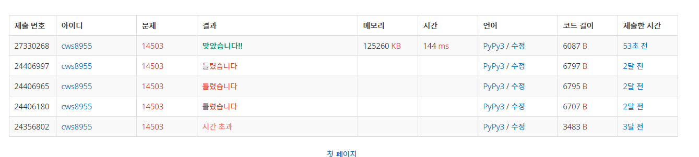

[백준 : 로봇 청소기] (https://www.acmicpc.net/problem/14503)


- 과거에 풀지 못했던 문제를 다시 풀어보았다.
- 단순한 구현문제였다.
- 중간에 error가 발생었는데 그 이유는 뒤로 가는 상황에서의 if문 ss==4 코드 묶음 아래의 ny =y 부터의 코드를 else문으로 받지 않아서 였다. 바꾸고 나니 바로 해결!!!!


```python
import sys
sys.stdin = open('14503.txt','r')
from collections import deque


def bfs():
    global sy,sx,dd,arr,ans,visit,pan

    q = deque()
    q.append([sy,sx,dd])
    visit[sy][sx][dd] = 1
    pan[sy][sx] = 1
    ans += 1

    while q:
        y,x,d = q.popleft()

        # print(y,x,d,q)

        if d == 0:
            ss = 0
            for k in range(4):
                ty = y+dy[k]
                tx = x+dx[k]
                if 0<=ty<n and 0<=tx<m:
                    if pan[ty][tx] == 1 or arr[ty][tx] == 1:
                        ss += 1
            if ss == 4:
                tty = y+1
                ttx = x
                if 0<=tty<n and 0<=ttx<m:
                    if arr[tty][ttx] == 0:
                        q.append([tty,ttx,0])
                    else:
                        break
            else:
                ny = y
                nx = x-1
                if 0<=ny<n and 0<=nx<m:
                    if arr[ny][nx] == 0:
                        if visit[ny][nx][3] == 0 and pan[ny][nx] == 0:
                            if pan[ny][nx] == 0:
                                pan[ny][nx] = 1
                                ans += 1
                            visit[ny][nx][3] = 1
                            q.append([ny,nx,3])
                        else:
                            if visit[y][x][3] == 0:
                                # visit[y][x][3] = 1
                                q.append([y,x,3])
                    else:
                        if visit[y][x][3] == 0:
                            # visit[y][x][3] = 1
                            q.append([y,x,3])
        elif d == 1:
            ss = 0
            for k in range(4):
                ty = y+dy[k]
                tx = x+dx[k]
                if 0<=ty<n and 0<=tx<m:
                    if pan[ty][tx] == 1 or arr[ty][tx] == 1:
                        ss += 1
            if ss == 4:
                tty = y
                ttx = x-1
                if 0<=tty<n and 0<=ttx<m:
                    if arr[tty][ttx] == 0:
                        q.append([tty,ttx,1])
                    else:
                        break
            else:
                ny = y-1
                nx = x
                if 0<=ny<n and 0<=nx<m:
                    if arr[ny][nx] == 0:
                        if visit[ny][nx][0] == 0 and pan[ny][nx] == 0:
                            # print(pan[ny][nx])
                            if pan[ny][nx] == 0:
                                pan[ny][nx] = 1
                                ans += 1
                            visit[ny][nx][0] = 1
                            q.append([ny,nx,0])
                        else:
                            if visit[y][x][0] == 0:
                                # print('---ss')
                                # visit[y][x][0] = 1
                                q.append([y,x,0])
                    else:
                        if visit[y][x][0] == 0:
                            # print('---dd')
                            # visit[y][x][0] = 1
                            q.append([y,x,0])
        elif d == 2:
            ss = 0
            for k in range(4):
                ty = y+dy[k]
                tx = x+dx[k]
                if 0<=ty<n and 0<=tx<m:
                    if pan[ty][tx] == 1 or arr[ty][tx] == 1:
                        ss += 1
            if ss == 4:
                tty = y-1
                ttx = x
                if 0<=tty<n and 0<=ttx<m:
                    if arr[tty][ttx] == 0:
                        q.append([tty,ttx,2])
                    else:
                        break
            else:
                ny = y
                nx = x+1
                if 0<=ny<n and 0<=nx<m:
                    if arr[ny][nx] == 0:
                        if visit[ny][nx][1] == 0 and pan[ny][nx] == 0:
                            if pan[ny][nx] == 0:
                                pan[ny][nx] = 1
                                ans += 1
                            visit[ny][nx][1] = 1
                            q.append([ny,nx,1])
                        else:
                            if visit[y][x][1] == 0:
                                # visit[y][x][1] = 1
                                q.append([y,x,1])
                    else:
                        if visit[y][x][1] == 0:
                            # visit[y][x][1] = 1
                            q.append([y,x,1])
        elif d == 3:
            ss = 0
            for k in range(4):
                ty = y+dy[k]
                tx = x+dx[k]
                if 0<=ty<n and 0<=tx<m:
                    if pan[ty][tx] == 1 or arr[ty][tx] == 1:
                        ss += 1
            if ss == 4:
                tty = y
                ttx = x+1
                if 0<=tty<n and 0<=ttx<m:
                    if arr[tty][ttx] == 0:
                        q.append([tty,ttx,3])
                    else:
                        break
            else:
                ny = y+1
                nx = x
                if 0<=ny<n and 0<=nx<m:
                    if arr[ny][nx] == 0:
                        if visit[ny][nx][2] == 0 and pan[ny][nx] == 0:
                            if pan[ny][nx] == 0:
                                pan[ny][nx] = 1
                                ans += 1
                            visit[ny][nx][2] = 1
                            q.append([ny,nx,2])
                        else:
                            if visit[y][x][2] == 0:
                                # visit[y][x][2] = 1
                                q.append([y,x,2])
                    else:
                        if visit[y][x][2] == 0:
                            # visit[y][x][2] = 1
                            q.append([y,x,2])

    return


dy = [-1,0,1,0] # 북,동,남,서 but 회전은 반대방향 0,1,2,3
dx = [0,1,0,-1]
n,m = map(int, input().split())
sy,sx,dd = map(int, input().split())
arr = []
for _ in range(n):
    arr1 = list(map(int, input().split()))
    arr.append(arr1)
visit =[[[0]*4 for _ in range(m)]for _ in range(n)]

pan = [[0]*m for _ in range(n)]

ans = 0

bfs()

print(ans)
```

