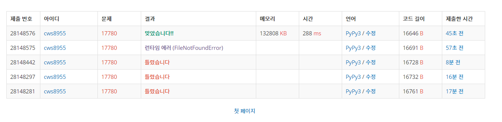

[백준 : 새로운 게임] (https://www.acmicpc.net/problem/17780)


##### 2021.04.08


- 예전에 새로운 게임2를 풀었어서 그런가 구현과정은 쉬웠다.
- 자료구조의 경우
  - 판(arr)과 똑같은 크기의 positions라는 배열을 만든다.
  - positions에는 각 말이 놓인 판의 상태가 표현됨
  - mals라는 리스트를 만든다,
  - mals에는 각 말들의 상태가 표현됨 (y좌표,x좌표,방향,말의 번호)
- 이동하는 칸이 흰칸인 경우
- 이동하는 칸이 빨간칸인 경우
- 이동하는 칸이 파란칸인 경우
  - 그래서 재이동하는 칸이 흰칸인 경우
  - 그래서 재이동하는 칸이 빨간칸인 경우
  - 그래서 재이동하는 칸이 파란칸인 경우
- 판의 크기를 넘어서 반대로 움직여야 하는 경우
  - 반대 방향의 칸이 흰칸인 경우
  - 반대방향의 칸이 빨간칸인 경우
  - 반대방향의 칸이 파란칸인 경우
- 이 경우들을 모두 if문으로 각기 처리해줌


```python
import sys
sys.stdin = open('17780.txt','r')
from collections import deque
from copy import deepcopy


def move():
    global n,m,arr,positions,mals,flag,answer


    ll = len(mals)
    for k in range(ll):
        y,x,d,s = mals[k]
        if positions[y][x][0] == s:
            if d == 1:
                ny = y
                nx = x+1
                if 0<=ny<n and 0<=nx<n:
                    if arr[ny][nx] == 0:
                        temps = deepcopy(positions[y][x])
                        positions[y][x] = []
                        positions[ny][nx] += temps
                        if len(positions[ny][nx]) >= 4:
                            answer = 1
                            flag = True
                            break
                        for temp in temps:
                            mals[temp][0] = ny
                            mals[temp][1] = nx
                    if arr[ny][nx] == 1:
                        temps = deepcopy(positions[y][x])
                        temps.reverse()
                        positions[y][x] = []
                        positions[ny][nx] += temps
                        if len(positions[ny][nx]) >= 4:
                            answer = 1
                            flag = True
                            break
                        for temp in temps:
                            mals[temp][0] = ny
                            mals[temp][1] = nx
                    if arr[ny][nx] == 2:
                        if 0<=x-1<n:
                            if arr[y][x-1] == 0:
                                mals[s][2] = 2
                                temps = deepcopy(positions[y][x])
                                positions[y][x] = []
                                positions[ny][x-1] += temps
                                if len(positions[ny][x-1]) >= 4:
                                    answer = 1
                                    flag = True
                                    break
                                for temp in temps:
                                    mals[temp][0] = ny
                                    mals[temp][1] = x-1
                            if arr[y][x-1] == 1:
                                mals[s][2] = 2
                                temps = deepcopy(positions[y][x])
                                temps.reverse()
                                positions[y][x] = []
                                positions[ny][x-1] += temps
                                if len(positions[ny][x-1]) >= 4:
                                    answer = 1
                                    flag = True
                                    break
                                for temp in temps:
                                    mals[temp][0] = ny
                                    mals[temp][1] = x-1
                            if arr[y][x-1] == 2:
                                mals[s][2] = 2
                        else:
                            mals[s][2] = 2
                else:
                    if arr[y][x-1] == 0:
                        mals[s][2] = 2
                        temps = deepcopy(positions[y][x])
                        positions[y][x] = []
                        positions[ny][x-1] += temps
                        if len(positions[ny][x-1]) >= 4:
                            answer = 1
                            flag = True
                            break
                        for temp in temps:
                            mals[temp][0] = ny
                            mals[temp][1] = x-1
                    if arr[y][x-1] == 1:
                        mals[s][2] = 2
                        temps = deepcopy(positions[y][x])
                        temps.reverse()
                        positions[y][x] = []
                        positions[ny][x-1] += temps
                        if len(positions[ny][x-1]) >= 4:
                            answer = 1
                            flag = True
                            break
                        for temp in temps:
                            mals[temp][0] = ny
                            mals[temp][1] = x-1
                    if arr[y][x-1] == 2:
                        mals[s][2] = 2
            
            if d == 2:
                ny = y
                nx = x-1
                if 0<=ny<n and 0<=nx<n:
                    if arr[ny][nx] == 0:
                        temps = deepcopy(positions[y][x])
                        positions[y][x] = []
                        positions[ny][nx] += temps
                        if len(positions[ny][nx]) >= 4:
                            answer = 1
                            flag = True
                            break
                        for temp in temps:
                            mals[temp][0] = ny
                            mals[temp][1] = nx
                    if arr[ny][nx] == 1:
                        temps = deepcopy(positions[y][x])
                        temps.reverse()
                        positions[y][x] = []
                        positions[ny][nx] += temps
                        if len(positions[ny][nx]) >= 4:
                            answer = 1
                            flag = True
                            break
                        for temp in temps:
                            mals[temp][0] = ny
                            mals[temp][1] = nx
                    if arr[ny][nx] == 2:
                        if 0<=x+1<n:
                            if arr[y][x+1] == 0:
                                mals[s][2] = 1
                                temps = deepcopy(positions[y][x])
                                positions[y][x] = []
                                positions[ny][x+1] += temps
                                if len(positions[ny][x+1]) >= 4:
                                    answer = 1
                                    flag = True
                                    break
                                for temp in temps:
                                    mals[temp][0] = ny
                                    mals[temp][1] = x+1
                            if arr[y][x+1] == 1:
                                mals[s][2] = 1
                                temps = deepcopy(positions[y][x])
                                temps.reverse()
                                positions[y][x] = []
                                positions[ny][x+1] += temps
                                if len(positions[ny][x+1]) >= 4:
                                    answer = 1
                                    flag = True
                                    break
                                for temp in temps:
                                    mals[temp][0] = ny
                                    mals[temp][1] = x+1
                            if arr[y][x+1] == 2:
                                mals[s][2] = 1
                        else:
                            mals[s][2] = 1
                else:
                    if arr[y][x+1] == 0:
                        mals[s][2] = 1
                        temps = deepcopy(positions[y][x])
                        positions[y][x] = []
                        positions[ny][x+1] += temps
                        if len(positions[ny][x+1]) >= 4:
                            answer = 1
                            flag = True
                            break
                        for temp in temps:
                            mals[temp][0] = ny
                            mals[temp][1] = x+1
                    if arr[y][x+1] == 1:
                        mals[s][2] = 1
                        temps = deepcopy(positions[y][x])
                        temps.reverse()
                        positions[y][x] = []
                        positions[ny][x+1] += temps
                        if len(positions[ny][x+1]) >= 4:
                            answer = 1
                            flag = True
                            break
                        for temp in temps:
                            mals[temp][0] = ny
                            mals[temp][1] = x+1
                    if arr[y][x+1] == 2:
                        mals[s][2] = 1

            if d == 4:
                ny = y+1
                nx = x
                if 0<=ny<n and 0<=nx<n:
                    if arr[ny][nx] == 0:
                        temps = deepcopy(positions[y][x])
                        positions[y][x] = []
                        positions[ny][nx] += temps
                        if len(positions[ny][nx]) >= 4:
                            answer = 1
                            flag = True
                            break
                        for temp in temps:
                            mals[temp][0] = ny
                            mals[temp][1] = nx
                    if arr[ny][nx] == 1:
                        temps = deepcopy(positions[y][x])
                        temps.reverse()
                        positions[y][x] = []
                        positions[ny][nx] += temps
                        if len(positions[ny][nx]) >= 4:
                            answer = 1
                            flag = True
                            break
                        for temp in temps:
                            mals[temp][0] = ny
                            mals[temp][1] = nx
                    if arr[ny][nx] == 2:
                        if 0<=y-1<n:
                            if arr[y-1][nx] == 0:
                                mals[s][2] = 3
                                temps = deepcopy(positions[y][x])
                                positions[y][x] = []
                                positions[y-1][nx] += temps
                                if len(positions[y-1][nx]) >= 4:
                                    answer = 1
                                    flag = True
                                    break
                                for temp in temps:
                                    mals[temp][0] = y-1
                                    mals[temp][1] = nx
                            if arr[y-1][nx] == 1:
                                mals[s][2] = 3
                                temps = deepcopy(positions[y][x])
                                temps.reverse()
                                positions[y][x] = []
                                positions[y-1][nx] += temps
                                if len(positions[y-1][nx]) >= 4:
                                    answer = 1
                                    flag = True
                                    break
                                for temp in temps:
                                    mals[temp][0] = y-1
                                    mals[temp][1] = nx
                            if arr[y-1][nx] == 2:
                                mals[s][2] = 3
                        else:
                            mals[s][2] = 3
                else:
                    if arr[y-1][nx] == 0:
                        mals[s][2] = 3
                        temps = deepcopy(positions[y][x])
                        positions[y][x] = []
                        positions[y-1][nx] += temps
                        if len(positions[y-1][nx]) >= 4:
                            answer = 1
                            flag = True
                            break
                        for temp in temps:
                            mals[temp][0] = y-1
                            mals[temp][1] = nx
                    if arr[y-1][nx] == 1:
                        mals[s][2] = 3
                        temps = deepcopy(positions[y][x])
                        temps.reverse()
                        positions[y][x] = []
                        positions[y-1][nx] += temps
                        if len(positions[y-1][nx]) >= 4:
                            answer = 1
                            flag = True
                            break
                        for temp in temps:
                            mals[temp][0] = y-1
                            mals[temp][1] = nx
                    if arr[y-1][nx] == 2:
                        mals[s][2] = 3

            if d == 3:
                ny = y-1
                nx = x
                if 0<=ny<n and 0<=nx<n:
                    if arr[ny][nx] == 0:
                        temps = deepcopy(positions[y][x])
                        positions[y][x] = []
                        positions[ny][nx] += temps
                        if len(positions[ny][nx]) >= 4:
                            answer = 1
                            flag = True
                            break
                        for temp in temps:
                            mals[temp][0] = ny
                            mals[temp][1] = nx
                    if arr[ny][nx] == 1:
                        temps = deepcopy(positions[y][x])
                        temps.reverse()
                        positions[y][x] = []
                        positions[ny][nx] += temps
                        if len(positions[ny][nx]) >= 4:
                            answer = 1
                            flag = True
                            break
                        for temp in temps:
                            mals[temp][0] = ny
                            mals[temp][1] = nx
                    if arr[ny][nx] == 2:
                        if 0<=y+1<n:
                            if arr[y+1][nx] == 0:
                                mals[s][2] = 4
                                temps = deepcopy(positions[y][x])
                                positions[y][x] = []
                                positions[y+1][nx] += temps
                                if len(positions[y+1][nx]) >= 4:
                                    answer = 1
                                    flag = True
                                    break
                                for temp in temps:
                                    mals[temp][0] = y+1
                                    mals[temp][1] = nx
                            if arr[y+1][nx] == 1:
                                mals[s][2] = 4
                                temps = deepcopy(positions[y][x])
                                temps.reverse()
                                positions[y][x] = []
                                positions[y+1][nx] += temps
                                if len(positions[y+1][nx]) >= 4:
                                    answer = 1
                                    flag = True
                                    break
                                for temp in temps:
                                    mals[temp][0] = y+1
                                    mals[temp][1] = nx
                            if arr[y+1][nx] == 2:
                                mals[s][2] = 4
                        else:
                            mals[s][2] = 4
                else:
                    if arr[y+1][nx] == 0:
                        mals[s][2] = 4
                        temps = deepcopy(positions[y][x])
                        positions[y][x] = []
                        positions[y+1][nx] += temps
                        if len(positions[y+1][nx]) >= 4:
                            answer = 1
                            flag = True
                            break
                        for temp in temps:
                            mals[temp][0] = y+1
                            mals[temp][1] = nx
                    if arr[y+1][nx] == 1:
                        mals[s][2] = 4
                        temps = deepcopy(positions[y][x])
                        temps.reverse()
                        positions[y][x] = []
                        positions[y+1][nx] += temps
                        if len(positions[y+1][nx]) >= 4:
                            answer = 1
                            flag = True
                            break
                        for temp in temps:
                            mals[temp][0] = y+1
                            mals[temp][1] = nx
                    if arr[y+1][nx] == 2:
                        mals[s][2] = 4


        


    return


dy = [0,0,0,-1,1]
dx = [0,1,-1,0,0]
n,m = map(int,input().split())
arr = []
for _ in range(n):
    board = list(map(int, input().split()))
    arr.append(board)

positions = [[[]for _ in range(n)] for _ in range(n)]

mals = deque()

for s in range(m):
    y,x,d = map(int,input().split())
    y -= 1
    x -= 1
    positions[y][x].append(s)
    mals.append([y,x,d,s])


answer = 9876543210
flag = False
cnt = 1
while cnt < 1000:

    move()
    if flag == True:
        break

    cnt += 1

if answer == 9876543210:
    print(-1)
else:
    print(cnt) 
```

