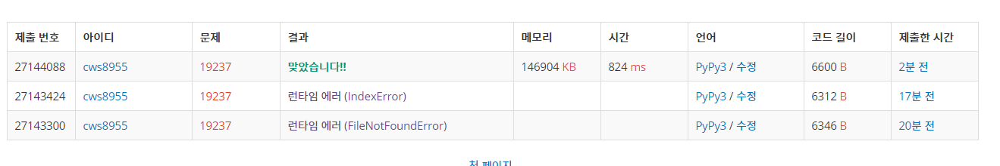

[백준 19237 : 어른상어] (https://www.acmicpc.net/problem/19237)


### 삼성 역량 테스트 기출문항

###### 맞추긴 했는데 너무 힘들었다.


- 로직은 문제에 나온 구현의 순서대로 구현하였다. 
- 다만 중간에 지속적인 오류가 나는 파트가 존재했다.
- 죽은 상어들이 사라지면서 큐의 길이와 관련된 오류가 발생했었다. 이를 해결하기위해
  - delete_lst라는 가상의 배열을 만 든후 마지막에 상어들을 삭제해 주었다. 
  - 상어들의 죽는 과정이 생각보다 너무 버거웠다.


2021.03.10


```python
import sys
sys.stdin = open('19237.txt','r')
from collections import deque
from copy import deepcopy

def moving():
    global n,m,k,arr,shark,smell,move,temp_arr,temp_shark

    ll = len(shark)

    ## 상어들의 이동과정
    for w in range(ll):
        arr = shark.popleft()
        if arr != []:
            d,cn,y,x = arr[0],arr[1],arr[2],arr[3]

            temp_direction = deepcopy(move[cn][d-1])


            zero_cnt = 4
            for kk in temp_direction:
                if kk == 1:
                    ny = y-1
                    nx = x
                    if 0<=ny<n and 0<=nx<n:
                        if smell[ny][nx] == []:
                            temp_shark.append([kk,cn,ny,nx])
                            zero_cnt -= 1
                            break
                        # else:
                        #     zero_cnt -= 1
                    # else:
                    #     zero_cnt += 1
                elif kk == 2:
                    ny = y+1
                    nx = x
                    if 0<=ny<n and 0<=nx<n:
                        if smell[ny][nx] == []:
                            temp_shark.append([kk,cn,ny,nx])
                            zero_cnt -= 1
                            break
                        # else:
                        #     zero_cnt -= 1
                    # else:
                    #     zero_cnt += 1
                elif kk == 3:
                    ny = y
                    nx = x-1
                    if 0<=ny<n and 0<=nx<n:
                        if smell[ny][nx] == []:
                            temp_shark.append([kk,cn,ny,nx])
                            zero_cnt -= 1
                            break
                        # else:
                        #     zero_cnt -= 1
                    # else:
                    #     zero_cnt += 1
                elif kk == 4:
                    ny = y
                    nx = x+1
                    if 0<=ny<n and 0<=nx<n:
                        if smell[ny][nx] == []:
                            temp_shark.append([kk,cn,ny,nx])
                            zero_cnt -= 1
                            break
                        # else:
                        #     zero_cnt -= 1
                    # else:
                    #     zero_cnt += 1

            if zero_cnt == 4:

                temp_direction = deepcopy(move[cn][d-1])
                for kk in temp_direction:
                    if kk == 1:
                        ny = y-1
                        nx = x
                        if 0<=ny<n and 0<=nx<n:
                            if smell[ny][nx][0] == cn:
                                temp_shark.append([kk,cn,ny,nx])
                                break
                    if kk == 2:
                        ny = y+1
                        nx = x
                        if 0<=ny<n and 0<=nx<n:
                            if smell[ny][nx][0] == cn:
                                temp_shark.append([kk,cn,ny,nx])
                                break
                    if kk == 3:
                        ny = y
                        nx = x-1
                        if 0<=ny<n and 0<=nx<n:
                            if smell[ny][nx][0] == cn:
                                temp_shark.append([kk,cn,ny,nx])
                                break
                    if kk == 4:
                        ny = y
                        nx = x+1
                        if 0<=ny<n and 0<=nx<n:
                            if smell[ny][nx][0] == cn:
                                temp_shark.append([kk,cn,ny,nx])
                                break
        
    ## 다시 세팅
    shark = deepcopy(temp_shark)
    temp = deepcopy(temp_shark)
    temp_shark = deque()
    temp_shark.append([])
    # temp_shark = deque([] for _ in range(m+1))

    
    ## 이전의 smell을 -1 하는 과정
    for y in range(n):
        for x in range(n):
            if smell[y][x] != []:
                if smell[y][x][1] >0:
                    smell[y][x][1] -=1
                    if smell[y][x][1] == 0:
                        smell[y][x] = []

    death_shark = []

    ## 같은 위치 상어 먹는 과정
    # print(temp)
    s = temp.popleft()
    # print(s)
    # s = temp.popleft()
    # print(s)
    # s = temp.popleft()
    # print(s)

    ll = len(temp)
    for sha in range(ll):
        d,cn,y,x = temp.popleft()
        # print('dsfsf',d,cn,y,x)

        if temp_arr[y][x] == 0:
            temp_arr[y][x] = cn
            smell[y][x] = [cn,k]
        elif temp_arr[y][x] != 0 and temp_arr[y][x] > cn:
            death_shark.append(temp_arr[y][x])
            temp_arr[y][x] = cn
            smell[y][x] = [cn,k]
        elif temp_arr[y][x] != 0 and temp_arr[y][x] < cn:
            death_shark.append(cn)

    # print(death_shark)

    delete_lst = []
    
    ll = len(shark)
    for de in death_shark:
        # print(ll)
        for sha in range(ll):
            if shark[sha] != []:
                if shark[sha][1] == de:
                    delete_lst.append(shark[sha])
            # ll = len(shark)
            # print(shark)
    for de in delete_lst:
        shark.remove(de)


    arr = deepcopy(temp_arr)
    temp_arr = [[0]*(n) for _ in range(n)]

    return


    
def confirm():
    global shark

    if len(shark) == 2:
        return 1
    else:
        return 2


dy = [0,-1,1,0,0]
dx = [0,0,0,-1,1]

n,m,k = map(int,input().split())

arr = []
shark = deque([] for _ in range(m+1))
smell = [[[]for _ in range(n)] for _ in range(n)]
move = [[] for _ in range(m+1)] # 완성

temp_arr = [[0]*(n) for _ in range(n)]
temp_shark = deque()
temp_shark.append([])
for _ in range(n):
    arr1 = list(map(int, input().split()))
    arr.append(arr1)

temp = list(map(int, input().split()))

cn = 1
for y in range(n):
    for x in range(n):
        if arr[y][x] != 0:
            shark[arr[y][x]] = [arr[y][x],y,x]
            cn += 1
            smell[y][x] = [arr[y][x],k]

# print(arr)

for s in range(len(temp)):
    shark[s+1].insert(0,temp[s])

for who in range(1,m+1):
    for dire in range(4):
        arr1 = list(map(int, input().split()))
        move[who].append(arr1)

second = 1
while second <= 1000:

    # print(shark)
    moving()

    # print(shark)
    # for ar in arr:
    #     for a in ar:
    #         print(a , end= ' ')
    #     print()
    # print('-----------')
    # for sm in smell:
    #     for s in sm:
    #         print(s, end= ' ')
    #     print()

    

    many = confirm()
    if many == 1:
        break
    second += 1

if second > 1000:
    print(-1)
else:
    print(second)

```



 [readme.md](readme.md) 