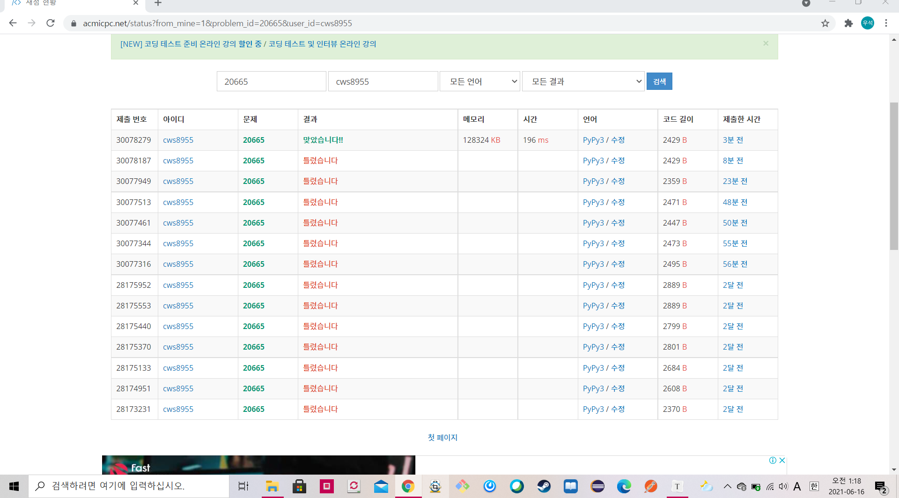

[백준 : 독서실 거리두기] (https://www.acmicpc.net/problem/20665)


- 어려웠던 문제......
- 시간을 분으로 바꿔준다는 개념과 다음 좌석을 찾는 로직이 어려웠다.


```python
import sys
sys.stdin = open('20665.txt','r')
import heapq
from collections import deque

def change(ls):
    a = [0,0]
    start = str(ls[0])
    end = str(ls[1])

    # print(start,end)
    
    if len(start) == 4:
        start_hour = start[0:2]
        start_minute = start[2:]

        start_hour = int(start_hour)
        start_hour *= 60
        start_minute = int(start_minute)
    else:
        start_hour = start[0:1]
        start_minute = start[1:]

        start_hour = int(start_hour)
        start_hour *= 60
        start_minute = int(start_minute)

    if len(end) == 4:
        end_hour = end[0:2]
        end_minute = end[2:]

        end_hour = int(end_hour)
        end_hour *= 60
        end_minute = int(end_minute)
    else:
        end_hour = end[0:1]
        end_minute = end[1:]

        end_hour = int(end_hour)
        end_hour *= 60
        end_minute = int(end_minute)


    a[0] = start_hour+start_minute-540
    a[1] = end_hour+end_minute-540

    return a
    
def search():
    global seats

    if sum(seats) == 0:
        return 1

    nxt = [0]+[float('inf')]*n

    
    for s in range(1,n+1):
        if seats[s] == 1: 
            cnt = 1
            nxt[s] = 0
            for l in range(s-1,-1,-1):
                if seats[l] == 0:
                    if nxt[l] > cnt:
                        nxt[l] = cnt
                if seats[l] == 1:
                    break
                cnt += 1

            cnt = 1
            for r in range(s+1,n+1):
                if seats[r] == 0:
                    if nxt[r] > cnt:
                        nxt[r] = cnt
                if seats[r] == 1:
                    break
                cnt += 1

    ss = max(nxt)
    a =nxt.index(ss)
        
    return a


n,t,w = map(int,input().split())

# arr = [[0]*721 for _ in range(n+1)]
lst = []
for _ in range(t):
    s,e = map(int,input().split())
    lst.append([s,e])

lst.sort(key=lambda x:x[0])

pq = []

for ls in lst:
    a = change(ls)
    pq.append(a)

seats = [0]*(n+1)
tq = []
want = []

pq.sort(key=lambda x:(x[0],x[1]))

pq = deque(pq)

while pq:
    start,end = pq.popleft()

    if start == end:
        continue

    while tq and tq[0][0] <= start:
        endd , seatt = heapq.heappop(tq)
        seats[seatt] = 0

    a = search()
    seats[a] = 1
    if a == w:
        want.append([start,end])
    heapq.heappush(tq,[end,a])


answer = 720
for wa in want:
    a = wa[1] - wa[0]
    answer -= a

print(answer)
```

