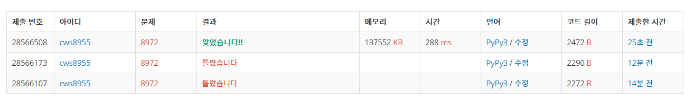

[백준 : 미친 아두이노] (https://www.acmicpc.net/problem/8972)


- 어려울것 같았지만 차근차근 해보니 의외로 쉬웠던 문제

- 문제에 주어진 내용 그대로 구현했다.
- 다만 생각해볼 점은 자료를 어떤  구조로 짰는가이다.
- robots : 아두이노들의 위치를 의미한다.
- many : 특정위치에 아두이노가 몇대인지 파악하는 작업을 한다. 2대 이상이면 폭발해야한다.
- lst : 이동한 아두이노들이다. 이 lst는 destroy에 의해 2대 이상 있는 곳은 파괴 된 후 robots로 변한다.
- destroy : 2대 이상인 아두이노의 위치들이 정리된 set()이다


```python
import sys
sys.stdin = open('8972.txt','r')
from collections import deque

def moveMe(d):
    global n,m,arr,robots,my,mx

    for k in range(1,10):
        if k == d:
            ny = my+dy[k]
            nx = mx+dx[k]
            if 0<=ny<n and 0<=nx<m:
                if arr[ny][nx] != 'R':
                    arr[my][mx] = '.'
                    arr[ny][nx] = 'I'
                    my = ny
                    mx = nx
                    return True

    return False

def moveRobots():
    global n,m,arr,robots,my,mx,many

    lst = set()
    destroy = set()

    while robots:
        y,x = robots.popleft()

        gy = 1000000
        gx = 1000000
        gg = 1000000000
        for k in range(8):
            ny = y+ry[k]
            nx = x+rx[k]
            if abs(my-ny)+abs(mx-nx) < gg:
                gy = ny
                gx = nx 
                gg = abs(my-ny)+abs(mx-nx)
        if arr[gy][gx] == 'I':
            return False
        lst.add((gy,gx))
        arr[y][x] = '.'
        arr[gy][gx] = 'R'
        many[gy][gx] += 1
        if many[gy][gx] > 1:
            destroy.add((gy,gx))

    for ls in lst:
        many[ls[0]][ls[1]] = 0


    for de in destroy:
        arr[de[0]][de[1]] = '.'
        lst.remove((de[0],de[1]))


    for ls in lst:
        robots.append([ls[0],ls[1]])
        arr[ls[0]][ls[1]] = 'R'

    # for ar in arr:
    #     for a in ar:
    #         print(a, end='')
    #     print()

    return True


ry = [1,1,1,0,0,-1,-1,-1]
rx = [-1,0,1,-1,1,-1,0,1]

dy = [0,1,1,1,0,0,0,-1,-1,-1]
dx = [0,-1,0,1,-1,0,1,-1,0,1]
n,m = map(int, input().split())
arr = []
for _ in range(n):
    arr1 = list(input())
    arr.append(arr1)

many = [[0]*m for _ in range(n)]

moving = list(map(int, input()))

move = deque()
for mo in moving:
    move.append(mo)

robots = deque()
my,mx = None, None

for y in range(n):
    for x in range(m):
        if arr[y][x] == 'R':
            robots.append([y,x])
        if arr[y][x] == 'I':
            my = y
            mx = x

cnt = 1
answer = True
while move:
    d = move.popleft()

    result_Me = moveMe(d)

    if result_Me == False:
        print("kraj {0}".format(cnt))
        answer = False
        break
    
    # print('-----------------------------------')
    result_robots = moveRobots()

    if result_robots == False:
        print("kraj {0}".format(cnt))
        answer = False
        break

    cnt += 1

if answer == True:
    for ar in arr:
        for a in ar:
            print(a, end='')
        print()


```


