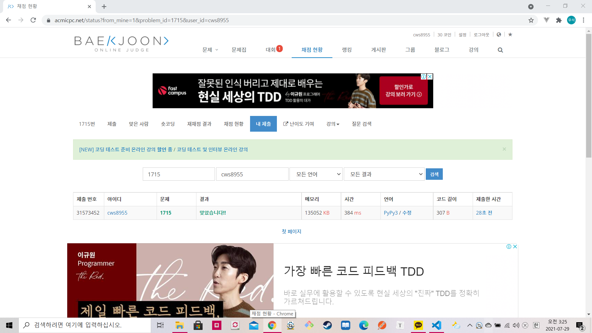

[ 백준 : 카드 정렬하기 ] (https://www.acmicpc.net/problem/1715)


- 2021-07-29 에 품

- 그리디 알고리즘을 활용한 우선순위큐 문제이다...
- 문제는 이 문제는 10분만에 풀었는데 '3인통화'라는 다익스트라 문제는 4시간 동안 못풀었다..... 100%에서 자꾸 틀렸습니다가 나온다.


```python
import sys
sys.stdin = open('1715.txt','r')
import heapq

n = int(input())
pq = []
answer = 0
for _ in range(n):
    a = int(input())
    heapq.heappush(pq,a)

while len(pq) > 1:
    output1 = heapq.heappop(pq)
    output2 = heapq.heappop(pq)
    innput = output1 + output2
    answer += innput
    heapq.heappush(pq,innput)

print(answer)


```

