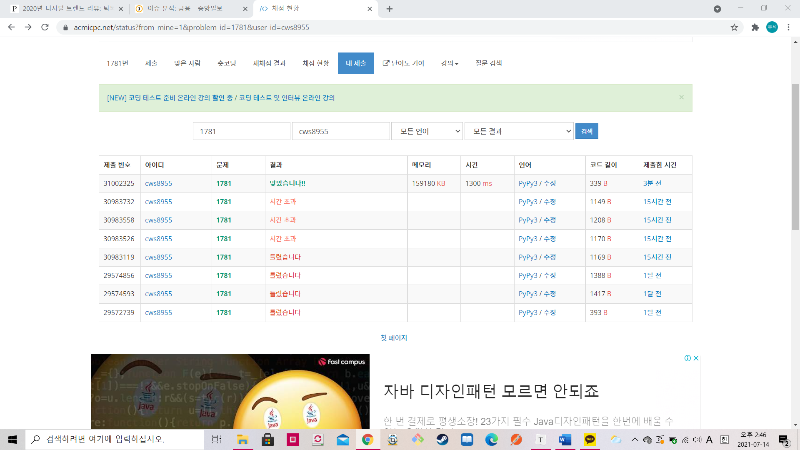

[백준 : 컵라면] (https://www.acmicpc.net/problem/1781)


- 대부분의 문제는 답을 보지 않는데 도저히 이 문제는 모르겠어서 어제 답을 봤다.
- 그리고 오늘 그 답을 생각하고 이해하면서 다시 풀어봤다.


```python
### 시간초과가 난 내 코드
### 거꾸로 탐색하는 방법을 사용했다. 1일부터가 아니라 마지막날 부터

import sys
import heapq
input = sys.stdin.readline

n = int(input())
day = 0
pq = []
for s in range(1,n+1):
    d,c = map(int, input().split())
    heapq.heappush(pq,[-d,c,s])
    if abs(d) > abs(day):
        day = -d

tq = []
answer = 0

while pq and day < 0:
    r_dead = 0
    r_cup = 0
    r_number = 0
    flag = False
    dead,cup,s = heapq.heappop(pq)
    # print('-----------------',dead,cup,s)
    # if dead <= day: 
    r_dead = dead
    r_cup = cup
    r_number = s 
    
    while pq and pq[0][0] <= day:
        flag = True
        dead2,cup2,s2 = heapq.heappop(pq)
        if cup2 > r_cup:
            heapq.heappush(tq,[r_dead,r_cup,r_number])
            r_dead = dead2
            r_cup = cup2
            r_number = s2
        elif cup2 <= r_cup:
            heapq.heappush(tq,[dead2,cup2,s2])
        
    # print(r_dead)
    if flag == False and day<r_dead:
        heapq.heappush(tq,[r_dead,r_cup,r_number])

    
    # print(tq,pq)

    pq += tq
    
    tq = []
    # print(pq)

    # print('=/==',pq)

    if day >= r_dead:
        answer += r_cup
    # print(day,r_number,r_dead,r_cup,pq)

    day += 1
    


print(answer)
```


```python
### 새로운 방법을 익힌 코드
### heapq에서 그냥 빼버리는 간단한 방식으로 풀 수 있는 코드 / 많은걸 배웠다


import sys
sys.stdin = open('1781.txt','r')
import heapq
input = sys.stdin.readline

n = int(input())
arr = []
for _ in range(n):
    deadline,cup_ramen = map(int, input().split())
    arr.append([deadline,cup_ramen])

arr.sort()
pq = []

for deadline, cup_ramen in arr:
    heapq.heappush(pq,cup_ramen)
    if deadline < len(pq):
        heapq.heappop(pq)

print(sum(pq))
```

