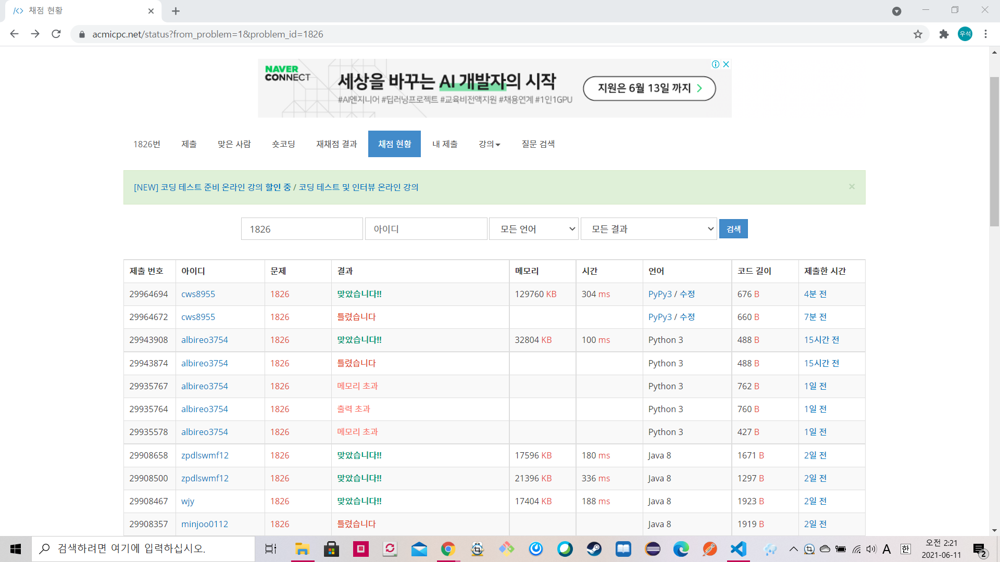

[백준 : 연료 채우기] (https://www.acmicpc.net/problem/1826)


- 우선순위 큐를 사용하는 문제
- 모든 주유소를 pq에 넣은 후 하나씩 출력

- 지금 있는 연료로 갈 수있는 주유소는 sq에 넣어준다
- 갈 수 없는 주유소를 만났을 때 기존에 sq에 넣어준 주유소중 연료를 가장 많이 주유할 수 있던 주유소를 꺼내와서 충전해준다. 
- 제 아무리 충전해도 못갈시에는 -1출력


```python
import sys
sys.stdin = open('1826.txt','r')
import heapq

pq = []
sq = []
n = int(input())
for _ in range(n):
    p,o = map(int, input().split())
    heapq.heappush(pq,[p,o])

end,f = map(int, input().split())
heapq.heappush(pq,[end,0])

answer = 0
flag = True
while len(pq) != 0:
    p,o = heapq.heappop(pq)

    if p>f:
        while p>f:
            oo,pp = heapq.heappop(sq)
            oo = -oo
            f += oo
            answer += 1
            if len(sq) == 0 and p>f:
                flag = False
                break

    heapq.heappush(sq,[-o,p])
    
    if flag == False:
        break

    if f >= end:
        break

if flag == False:
    print(-1)
else:
    print(answer)
```

