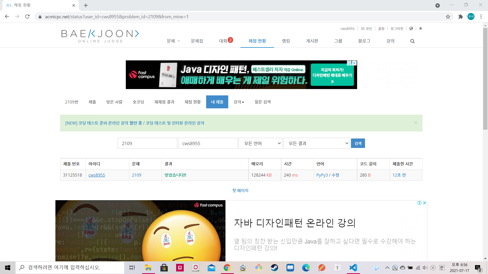

[백준 : 순회강연] (https://www.acmicpc.net/problem/2109)


- 1781 컵라면 문제와 사실상 같은 방식이다.


```python
import sys
sys.stdin = open('2109.txt','r')

import heapq

n = int(input())
pq = []
arr = []
for _ in range(n):
    money , day = map(int, input().split())
    arr.append([day,money])

arr.sort()

for day , money in arr:
    heapq.heappush(pq,money)
    if day < len(pq):
        heapq.heappop(pq)

print(sum(pq))
```

