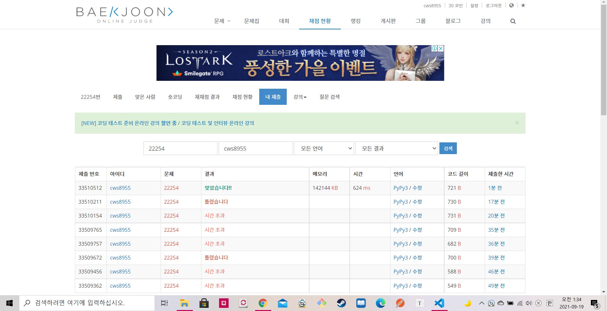

[ 백준 : 공정 컨설턴트 호석 ] (https://www.acmicpc.net/problem/22254)


- 이분탐색과 우선순위 큐를 동시에 활용하는 문제
- 우선순위큐와 관련해서 시간초과가 계속 났었는데 heapify로 heapq를 지정하면서 시간을 해결했다.


```python
import sys
sys.stdin = open('22254.txt','r')
import heapq
input = sys.stdin.readline

def work(m):
    global n,x,arr

    c = 0
    result = 0

    robots = [0]*m
    heapq.heapify(robots)


    while c < n:
        now = arr[c]
        t = heapq.heappop(robots)
        if t+now > result:
            result = t+now
            if result > x:
                break

        heapq.heappush(robots,t+now)
        c += 1
        
    if result > x:
        return False

    return True

n,x = map(int, input().split())
arr = list(map(int, input().split()))


left = 1
right = n

answer = 0

while left<=right:
    mid = (left+right) // 2

    if work(mid) == True:
        answer = mid
        right = mid-1
    else:
        left = mid+1

print(answer)
```

