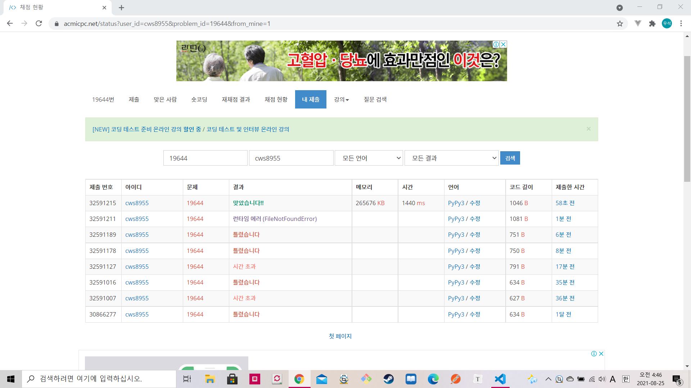

[ 백준 : 좀비 떼 ~~~ ] (https://www.acmicpc.net/problem/19644)


- 시간초과를 주의해야하는 문제
- 로직
  - 1. 각 위치별로 총으로 줄 수 있는 데미지의 합을 저장
    2. 폭탄을 터뜨릴 경우 폭탄을 터뜨린 곳부터 기관총 사거리 안까지의 저장된 각 데미지의 합에 데미지 만큼 빼준다
  - 2번까지만 하면 정확성은 100%다, 그러나 for문을 돌리면서 데미지의 합 배열을 수정해주면 시간초과가 난다. 
  - 이를 해결하기 위해 plus_list라는 배열을 만든 후 폭탄을 터뜨리면 터뜨린 곳의 위치를 넣어줬다.
  - plus는 폭탄을 터뜨릴 때마다 총데미지에서 빼줘야하는 값이다.
    - plus_list를 활용해서 기관총의 사거리를 넘어간경우 plus값을 조정해준다.
    - plus_list의 값은 한 번 참조할때 마다 popleft를 해준다.
      - 이제 그 값을 사용안하고 다음 위치에서의 확인과정을 해줘야 하기 때문


```python
import sys
sys.stdin = open('19644.txt','r')
input = sys.stdin.readline
from collections import deque

n = int(input())
l,damage = map(int,input().split())
bomb = int(input())
zombie = [0]
for _ in range(n):
    a = int(input())
    zombie.append(a)

now = 0
# attacks = []*len(zombie)
answer = True
attacks = [0]
for k in range(1,l+1):
    attacks.append(k*damage)
for k in range(l+1,n+1):
    attacks.append(l*damage)

plus_list = deque()
plus = 0

for k in range(n):
    if len(plus_list) > 0:
        if k - plus_list[-1] >l:
            plus -= damage
            plus_list.popleft()

    if zombie[k+1] > attacks[k+1]-plus:
        if bomb <= 0:
            answer = False
            break
        else:
            bomb -= 1
            plus += damage
            plus_list.append(k)
            # if k+1+l >n:
            #     for nxt in range(k+2,n+1):
            #         attacks[nxt] -= damage
            # else:
            #     for nxt in range(k+2,k+l+1):
            #         attacks[nxt] -= damage

if answer == True:
    print('YES')
else:
    print('NO')

```



