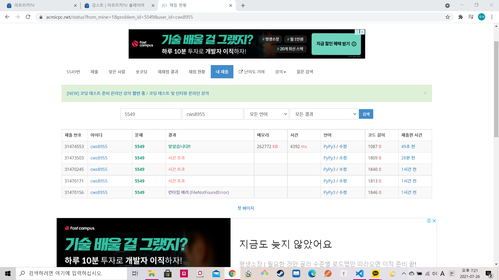

[백준 : 행성 탐사] (https://www.acmicpc.net/problem/5549)


- 2021-07-26에 푼 문제

- 엄청 고생했던 문제
- 위에서 아래로 누적합을 해주어 풀었다.


```python
import sys
sys.stdin = open('5549.txt','r')
input = sys.stdin.readline

n,m = map(int, input().split())
t = int(input())
cnt =[[[0,0,0] for _ in range(m)] for _ in range(n+1)]


arr = []
arr.append([0]*m)
for _ in range(n):
    ar = list(input())
    arr.append(ar)

for x in range(m):
    j = 0
    o = 0
    i = 0
    for y in range(1,n+1):
        if arr[y][x] == 'J':
            j += 1
            cnt[y][x][0] = j
            cnt[y][x][1] = o
            cnt[y][x][2] = i
        elif arr[y][x] == 'O':
            o += 1
            cnt[y][x][0] = j
            cnt[y][x][1] = o
            cnt[y][x][2] = i
        elif arr[y][x] == 'I':
            i += 1
            cnt[y][x][0] = j
            cnt[y][x][1] = o
            cnt[y][x][2] = i

for tc in range(t):
    sy,sx,ey,ex = map(int, input().split())
    sx -= 1
    ex -= 1

    aj = 0
    ao = 0
    ai = 0


    for x in range(sx,ex+1):
        aj += (cnt[ey][x][0] - cnt[sy-1][x][0]) 
        ao += (cnt[ey][x][1] - cnt[sy-1][x][1]) 
        ai += (cnt[ey][x][2] - cnt[sy-1][x][2]) 

    print(aj , end = ' ')
    print(ao , end = ' ')
    print(ai)

```



 [readme.md](readme.md) 